# 01 - Foundations: Student Learning Guide

> 📚 **Welcome Students!** This guide is designed for the San Jose State University hands-on session. It provides detailed explanations, diagrams, and learning objectives to help you master the fundamentals of Llama Stack.

---

## 🎯 Module Overview

Welcome to the Foundations module! This is your starting point for understanding **Llama Stack**, a comprehensive framework that provides unified APIs for building AI applications. Think of Llama Stack as a standardized toolkit that abstracts away the complexity of working with different AI models, vector databases, and tools.

### What You'll Build
By the end of this module, you'll understand how to:
- Connect to AI models and send chat requests
- Control AI behavior with system prompts
- Build semantic search systems using vector databases
- Integrate custom tools with AI applications

---

## 📖 Core Concepts Deep Dive

### Concept 1: Llama Stack Architecture

**What is Llama Stack?**
Llama Stack is a **standardized interface** that sits between your application and various AI services. It's like having a universal remote control for different AI providers.

**Why Do We Need It?**
- **Problem**: Different AI providers have different APIs (OpenAI, Anthropic, local models)
- **Solution**: Llama Stack provides one consistent API that works with all of them
- **Benefit**: Switch providers without rewriting your code!

**Architecture Diagram**:


**Real-World Analogy**:
Think of Llama Stack like a power adapter when traveling internationally. Instead of carrying different chargers for different countries, you have one adapter that works everywhere. Llama Stack is that adapter for AI services!

---

### Concept 2: Chat Completions API

**What is a Chat Completion?**
A chat completion is a request-response interaction with a language model. You send messages, the model generates a response.

**Message Structure**:
Every conversation has **roles**:
- **system**: Sets the AI's behavior and personality (like giving instructions to an actor)
- **user**: The human's message
- **assistant**: The AI's response

**Example**:
```python
messages = [
    {"role": "system", "content": "You are a helpful math tutor"},
    {"role": "user", "content": "What is 25 × 4?"},
    {"role": "assistant", "content": "25 × 4 = 100"},
    {"role": "user", "content": "Can you explain how you got that?"}
]
```

**Request-Response Flow**:


**Streaming vs Non-Streaming**:

| Non-Streaming | Streaming |
|--------------|-----------|
| Wait for complete response | Receive tokens as generated |
| Simpler to implement | Better user experience |
| Good for batch processing | Good for interactive apps |
| Lower overhead | Real-time feedback |

**Streaming Visual**:


---

### Concept 3: System Prompts - The Secret to AI Behavior Control

**What is a System Prompt?**
A system prompt is like giving a character sheet to an actor before a performance. It defines:
- The AI's personality
- How it should respond
- What it should prioritize
- Any constraints or rules

**Why It Matters**:
System prompts let you customize AI behavior WITHOUT retraining the model. This is incredibly powerful and cost-effective!

**Examples of System Prompts**:

1. **Customer Service Bot**:
```
You are a friendly and empathetic customer service representative for TechCo.
Always be polite, acknowledge customer frustrations, and provide clear solutions.
If you don't know something, admit it and offer to escalate to a human agent.
```

2. **Code Review Assistant**:
```
You are an experienced senior software engineer conducting code reviews.
Provide constructive feedback, highlight potential bugs, suggest improvements,
and explain the reasoning behind your suggestions. Be thorough but not overly critical.
```

3. **Teaching Assistant**:
```
You are a patient computer science teaching assistant helping undergraduate students.
Explain concepts using simple analogies, break down complex topics into steps,
and encourage learning by asking guiding questions rather than giving direct answers.
```

**System Prompt Impact**:


---

### Concept 4: Vector Databases & Semantic Search

**The Problem with Traditional Search**:
Traditional keyword search looks for exact word matches:
- Query: "car repair" → Only finds documents with those exact words
- Misses: "automobile maintenance", "vehicle fixing", "auto service"

**The Solution: Semantic Search**:
Semantic search understands **meaning**, not just words:
- Query: "car repair" → Finds all documents about vehicle maintenance
- Works because: Similar concepts have similar vector representations

**How Vector Embeddings Work**:

1. **Text → Numbers**: An embedding model converts text into a vector (array of numbers)
```
"The cat sat on the mat" → [0.2, 0.8, -0.3, 0.5, ..., 0.1]
                           (typically 384 to 1536 dimensions!)
```

2. **Meaning is Captured**: Words with similar meanings have similar vectors
```
"dog" → [0.3, 0.7, -0.2, ...]
"puppy" → [0.32, 0.68, -0.19, ...]  ← Very close!
"car" → [-0.5, 0.1, 0.9, ...]      ← Very different!
```

3. **Distance = Similarity**: We measure how "close" vectors are
```
distance("dog", "puppy") = 0.05  ← Very similar!
distance("dog", "car") = 0.89    ← Not similar!
```

**Vector Database Workflow**:


**Distance Metrics Explained**:

Most common: **Cosine Similarity**
- Measures the angle between two vectors
- Range: -1 (opposite) to 1 (identical)
- Typically converted to distance: `distance = 1 - similarity`

```mermaid
graph LR
    A[Vector A] -.Angle θ.- B[Vector B]
    C[Cosine Similarity = cos θ]
    D{Similar?}
    D -->|θ small<br/>cos θ ≈ 1| E[Very Similar]
    D -->|θ large<br/>cos θ ≈ 0| F[Not Similar]

    style E fill:#d4edda
    style F fill:#ffd6d6
```



**Why Chunking Matters**:

Large documents must be split into smaller pieces:


**Chunk Overlap** - Why It's Important:
```
Chunk 1: "...the mitochondria is the powerhouse of the cell. It produces ATP..."
                                                    ↓ OVERLAP
Chunk 2: "...It produces ATP through cellular respiration. This process..."
```
Without overlap, "ATP production" might be split awkwardly between chunks!

---

### Concept 5: Tools & Function Calling

**What are Tools?**
Tools extend AI capabilities beyond text generation. They allow the AI to:
- Perform calculations
- Search the web
- Query databases
- Fetch real-time data
- Execute code

**How Tools Work**:


**Tool Definition Example**:
```python
{
    "name": "get_weather",
    "description": "Get current weather for a city",
    "parameters": {
        "city": {
            "type": "string",
            "description": "City name"
        },
        "units": {
            "type": "string",
            "enum": ["celsius", "fahrenheit"],
            "default": "celsius"
        }
    }
}
```

**Model Context Protocol (MCP)**:

MCP is like **USB-C for AI tools** - a universal standard:


**Benefits of MCP**:
- ✅ Write tools once, use everywhere
- ✅ Share tools across applications
- ✅ Community tool ecosystem
- ✅ No custom integration code

---

## 📝 Demo Walkthroughs

### Demo 1: Client Setup

**Learning Goal**: Understand how to establish a connection to Llama Stack.

**Code Flow**:

```mermaid
flowchart TD
    A[START] --> B[Import LlamaStackClient]
    B --> C[Create client instance<br/>with host:port]
    C --> D[Make health check request]
    D --> E{Server<br/>Responding?}
    E -->|Yes| F[✅ Connection Successful]
    E -->|No| G[❌ Connection Failed]
    F --> H[Ready for AI operations]
    G --> I[Check server is running<br/>Verify host/port]

    style A fill:#e1f5ff
    style F fill:#d4edda
    style G fill:#ffd6d6
    style H fill:#fff3cd
```


**Key Code**:
```python
from llama_stack_client import LlamaStackClient

# Initialize client with server address
client = LlamaStackClient(base_url=f"http://{host}:{port}")

# Verify connection (implicit health check)
# If this works, you're connected!
```

**What to Observe**:
- Success message indicates connection is working
- This client object is used in all subsequent demos

---

### Demo 2: Chat Completion

**Learning Goal**: Send prompts to AI and receive responses (streaming vs non-streaming).

**Complete Flow Diagram**:

```mermaid
flowchart TD
    A[START: User provides prompt] --> B[Initialize Client]
    B --> C{Model specified?}
    C -->|No| D[Auto-select available model]
    C -->|Yes| E[Verify model exists]
    D --> F[Check model capability]
    E --> F
    F --> G{Can model chat?}
    G -->|No| H[❌ Error: Choose chat model]
    G -->|Yes| I[Format message with user role]
    I --> J{Streaming enabled?}

    J -->|Yes| K[Create streaming request]
    J -->|No| L[Create standard request]

    K --> M[For each chunk received]
    M --> N[Extract delta content]
    N --> O[Print token immediately]
    O --> P{More chunks?}
    P -->|Yes| M
    P -->|No| Q[Close stream]

    L --> R[Wait for complete response]
    R --> S[Extract message content]
    S --> T[Print full response]

    Q --> U[END]
    T --> U
    H --> V[EXIT]

    style A fill:#e1f5ff
    style J fill:#fff3cd
    style K fill:#d4edda
    style L fill:#d4edda
    style U fill:#e1f5ff
```


**Key Differences**:

| Aspect | Non-Streaming | Streaming |
|--------|--------------|-----------|
| **Code** | `stream=False` | `stream=True` |
| **Response** | Single complete object | Iterator of chunks |
| **Display** | All at once | Token by token |
| **Use Case** | Batch processing | Interactive chat |
| **Latency** | Wait for full response | See output immediately |

**Try This**:
```bash
# Non-streaming - wait for complete answer
python -m demos.01_foundations.02_chat_completion localhost 8321 \
  --prompt "Explain what Llama Stack is in one paragraph"

# Streaming - watch it type!
python -m demos.01_foundations.02_chat_completion localhost 8321 \
  --prompt "Explain what Llama Stack is in one paragraph" \
  --stream
```

---

### Demo 3: System Prompts

**Learning Goal**: Control AI personality and behavior through system prompts.

**How System Prompts Work**:


**Experiment Ideas**:

| System Prompt | Expected Behavior |
|--------------|-------------------|
| "You are a helpful assistant." | Balanced, informative responses |
| "You are concise. Keep responses under 20 words." | Very brief answers |
| "You are a Shakespearean poet." | Dramatic, poetic language |
| "You explain things using food analogies." | Creative comparisons |
| "You are skeptical and question everything." | Critical thinking approach |

**Try This**:
```bash
# Default behavior
python -m demos.01_foundations.03_system_prompts localhost 8321 \
  --prompt "What is machine learning?"

# Force concise responses
python -m demos.01_foundations.03_system_prompts localhost 8321 \
  --system_prompt "You respond in exactly one sentence." \
  --prompt "What is machine learning?"

# Creative responses
python -m demos.01_foundations.03_system_prompts localhost 8321 \
  --system_prompt "You explain everything using cooking analogies." \
  --prompt "What is machine learning?"
```

---

### Demo 4: Vector DB Basics

**Learning Goal**: Understand how semantic search works with vector databases.

**Complete Workflow**:


**The Magic of Semantic Search**:

Input:
- Document: "Llama Stack unifies AI services."
- Query: "What does Llama Stack do?"

Notice: Query uses different words ("do" vs "unifies", "What does" vs directly stated)

But semantic search finds it because:
1. Both get embedded to similar vectors
2. "unifies AI services" ≈ "What does [it] do" (conceptually related)
3. Distance metric identifies the match

**Try This**:
```bash
# Basic example
python -m demos.01_foundations.04_vector_db_basics localhost 8321

# Custom document and query
python -m demos.01_foundations.04_vector_db_basics localhost 8321 \
  --text "The quick brown fox jumps over the lazy dog." \
  --query "What animal is jumping?"
```

**What to Observe**:
- Even with different wording, the query finds the relevant document
- Similarity scores indicate how close the match is
- This is the foundation for RAG systems!

---

### Demo 5: Insert Documents

**Learning Goal**: Build a document knowledge base from files or URLs.

**Document Processing Pipeline**:


**Chunking Strategy Parameters**:

```python
chunking_strategy = {
    "type": "static",
    "static": {
        "max_chunk_size_tokens": 256,  # Size of each chunk
        "chunk_overlap_tokens": 32     # Overlap between chunks
    }
}
```

**Why Overlap?**
```
Document: "The mitochondria produces ATP. ATP powers cellular functions."

Without Overlap:
  Chunk 1: "The mitochondria produces ATP."
  Chunk 2: "ATP powers cellular functions."
  ❌ Context about what ATP is might be lost!

With Overlap:
  Chunk 1: "The mitochondria produces ATP."
  Chunk 2: "produces ATP. ATP powers cellular functions."
  ✅ ATP context preserved in both chunks!
```

**Try This**:
```bash
# Insert from URLs (default behavior)
python -m demos.01_foundations.05_insert_documents localhost 8321

# Insert from local directory
mkdir -p my_docs
echo "This is document 1 about AI" > my_docs/doc1.txt
echo "This is document 2 about ML" > my_docs/doc2.txt
python -m demos.01_foundations.05_insert_documents localhost 8321 \
  --file_dir ./my_docs
```

---

### Demo 6: Search Vectors

**Learning Goal**: Query your vector database to find relevant documents.

**Search Process**:


**Understanding Results**:

```
Query: "What does Llama Stack do?"

Results:
┌───────────────────────────────────────┬───────┐
│ Document Chunk                        │ Score │
├───────────────────────────────────────┼───────┤
│ "Llama Stack provides unified APIs..." │ 0.94  │ ← Excellent match!
│ "Features include vector stores..."    │ 0.72  │ ← Related content
│ "Installation requires Python 3.9..."  │ 0.41  │ ← Weak relation
└───────────────────────────────────────┴───────┘
```

**Score Interpretation**:
- **0.9-1.0**: Directly answers the query
- **0.7-0.89**: Highly relevant context
- **0.5-0.69**: Related but not specific
- **< 0.5**: Weak or tangential relation

**Try This**:
```bash
# Search for Llama Stack information
python -m demos.01_foundations.06_search_vectors localhost 8321 \
  --query "What does Llama Stack do?"

# Try semantic search (different words, same meaning)
python -m demos.01_foundations.06_search_vectors localhost 8321 \
  --query "How does this framework help developers?"
```

**Experiment**:
Try queries with:
- Different word choices
- More/less specific questions
- Related vs unrelated topics

Observe how semantic search finds meaning beyond keywords!

---

### Demo 7: Tool Runtime API

**Learning Goal**: Register and invoke tools programmatically.

**Tool Registration & Invocation Flow**:

```mermaid
flowchart TD
    A[START] --> B[Define Toolgroup Configuration]

    B --> C[Register Toolgroup<br/>toolgroups.register]

    C --> D{Registration<br/>Successful?}
    D -->|No| E[❌ Check provider config]
    D -->|Yes| F[List Available Tools<br/>tool_runtime.list_tools]

    F --> G[Display Tool Catalog:<br/>- Name<br/>- Description<br/>- Parameters]

    G --> H[Select Tool to Invoke]

    H --> I[Prepare Tool Parameters]

    I --> J[Invoke Tool<br/>tool_runtime.invoke_tool]

    J --> K[Tool Executes]

    K --> L[Return Result]

    L --> M[Display Output]

    M --> N[END]

    style B fill:#e1f5ff
    style C fill:#fff3cd
    style F fill:#fff3cd
    style J fill:#d4edda
    style L fill:#ffd6d6
```


**Tool Definition Structure**:
```python
{
    "tool_name": "add",
    "description": "Add two numbers together",
    "parameters": {
        "a": {"type": "number", "description": "First number"},
        "b": {"type": "number", "description": "Second number"}
    },
    "return": {
        "type": "number",
        "description": "Sum of a and b"
    }
}
```

**API Methods**:

1. **Register Toolgroup**:
```python
client.toolgroups.register(
    toolgroup_id="my-tools",
    provider_id="inline",
    tools=[tool_definition]
)
```

2. **List Tools**:
```python
tools = client.tool_runtime.list_tools()
```

3. **Invoke Tool**:
```python
result = client.tool_runtime.invoke_tool(
    tool_name="add",
    args={"a": 5, "b": 3}
)
```

**Try This**:
```bash
python -m demos.01_foundations.07_tool_registration localhost 8321
```

**What Happens**:
1. Registers a math toolgroup (add, multiply)
2. Lists all available tools
3. Invokes the add tool with sample numbers
4. Displays the result

---

### Demo 8: MCP Tools

**Learning Goal**: Integrate external tools using Model Context Protocol.

**MCP Architecture**:


**Why MCP?**

Traditional approach (before MCP):
```
App 1 ──custom integration──> Tool A
App 1 ──custom integration──> Tool B
App 2 ──custom integration──> Tool A  ← Duplicate work!
App 2 ──custom integration──> Tool C
```

MCP approach:
```
App 1 ──MCP──┐
App 2 ──MCP──┼──> MCP Server ──> All Tools
App 3 ──MCP──┘
```

**Benefits**:
- ✅ Interoperability: Works across different AI platforms
- ✅ Reusability: Write once, use everywhere
- ✅ Community: Share and discover tools
- ✅ Standard: No custom integration per tool

**Step-by-Step Process**:

1. **Start MCP Server** (Terminal 1):
```bash
python -m demos.01_foundations.08_mcp_tools serve
# Server starts on http://localhost:8000
# Exposes tools via SSE endpoint
```

2. **Register with Llama Stack** (Terminal 2):
```bash
llama-stack-client toolgroups register plus-tools \
  --provider-id model-context-protocol \
  --mcp-endpoint "http://localhost:8000/sse"
# Llama Stack now knows about MCP tools
```

3. **Invoke Tool** (Terminal 2):
```bash
python -m demos.01_foundations.08_mcp_tools run localhost 8321 \
  --mcp_endpoint http://localhost:8000/sse \
  --tool_name add --a 1 --b 1
# Result: 2
```

**Try This**:
Create your own MCP tool!

```python
# In your MCP server
@server.tool()
def greet(name: str) -> str:
    """Greet someone by name"""
    return f"Hello, {name}! Welcome to MCP!"
```

---

## 🎓 Learning Checkpoints

Test your understanding with these questions:

### Checkpoint 1: Architecture
- [ ] Can you explain what Llama Stack does in your own words?
- [ ] Why is provider abstraction useful?
- [ ] What are the main APIs provided by Llama Stack?

### Checkpoint 2: Chat & Prompts
- [ ] What's the difference between system, user, and assistant roles?
- [ ] When would you use streaming vs non-streaming?
- [ ] How do system prompts change AI behavior?

### Checkpoint 3: Vector Search
- [ ] How does semantic search differ from keyword search?
- [ ] Why do we convert text to vectors?
- [ ] What is chunk overlap and why is it important?

### Checkpoint 4: Tools
- [ ] What can tools do that pure text generation cannot?
- [ ] How does MCP improve tool integration?
- [ ] When would you use direct tool invocation vs agent tool calling?

---

## 💡 Practice Exercises

### Exercise 1: Custom Personality Bot
Create a chatbot with a unique personality using system prompts.

**Challenge**: Make the AI respond as:
- A helpful librarian
- A skeptical scientist
- An enthusiastic sports commentator

**Hint**: Modify Demo 3's system_prompt parameter!

---

### Exercise 2: Build a Knowledge Base
Create a vector store with your own documents.

**Steps**:
1. Create 3-5 text files about different topics
2. Use Demo 5 to insert them into a vector store
3. Use Demo 6 to search with various queries
4. Observe which documents match different queries

**Questions**:
- Do semantically similar queries return the same documents?
- How do similarity scores help rank results?

---

### Exercise 3: Custom MCP Tool
Extend Demo 8 with your own tool.

**Ideas**:
- Temperature converter (Celsius ↔ Fahrenheit)
- Word counter
- Simple calculator with more operations
- Date/time formatter

**Requirements**:
- Define tool with parameters
- Implement the function logic
- Test through Llama Stack

---

## 🐛 Common Issues & Solutions

### Issue: Cannot connect to server
**Symptoms**: Connection refused errors

**Solutions**:
```bash
# Check if server is running
llama stack run

# Verify port is correct (default: 8321)
# Check firewall settings
```

---

### Issue: Model not found
**Symptoms**: "Model X not available" errors

**Solutions**:
```bash
# List available models
llama-stack-client models list

# Use any available model or add new ones
# to your Llama Stack configuration
```

---

### Issue: Vector search returns poor results
**Symptoms**: Low similarity scores, irrelevant matches

**Solutions**:
- Check embedding model is appropriate for your language
- Experiment with different chunk sizes
- Ensure documents are relevant to queries
- Verify embedding dimension matches vector store config

---

### Issue: MCP tools not registering
**Symptoms**: "Provider not found" or connection errors

**Solutions**:
```bash
# Ensure MCP server is running (Terminal 1)
python -m demos.01_foundations.08_mcp_tools serve

# Verify endpoint is accessible
curl http://localhost:8000/sse

# Check Llama Stack has MCP provider configured
```

---

## 📚 Additional Resources

- **Llama Stack Documentation**: [github.com/meta-llama/llama-stack](https://github.com/meta-llama/llama-stack)
- **Vector Database Concepts**: Learn more about FAISS, Chroma, Weaviate
- **Embedding Models**: Explore different embedding models and their use cases
- **MCP Protocol**: [modelcontextprotocol.org](https://modelcontextprotocol.org)

---

## 🎯 Next Module Preview

**Module 02: Responses Basics**

You'll learn about the higher-level Responses API which adds:
- Tool calling integration
- Multi-turn conversation management
- Structured JSON outputs
- Advanced response formatting

**Module 03: RAG (Retrieval-Augmented Generation)**

Combine what you learned about vector search with AI generation:
- Build complete RAG pipelines
- Multi-source retrieval
- Metadata filtering
- Hybrid search (local + web)

**Module 04: Agents**

Create autonomous AI agents that:
- Use tools to accomplish goals
- Maintain conversational context
- Process multimodal inputs (text + images)
- Coordinate multi-agent systems

---

## ✅ Module Completion Checklist

- [ ] Successfully connected to Llama Stack server
- [ ] Performed chat completions (streaming and non-streaming)
- [ ] Customized AI behavior with system prompts
- [ ] Created a vector store and inserted documents
- [ ] Performed semantic searches
- [ ] Registered and invoked tools
- [ ] Integrated MCP tools

**Congratulations on completing Foundations!** 🎉

You now have the core skills to build AI applications with Llama Stack. These fundamentals are the building blocks for everything else you'll learn in this course.

**Ready for the next challenge?** → Proceed to **Module 02: Responses Basics**
