# 02 - Responses Basics: Student Learning Guide

> 📚 **Module 02: Responses API** This module teaches you the higher-level Responses API, which provides enhanced capabilities beyond basic chat completions including tool calling, conversation management, and structured outputs.

---

## 🎯 Module Overview

In Module 01, you learned about the **Chat Completions API** - the foundation for talking to AI models. Now you'll learn about the **Responses API**, which is a more powerful abstraction that adds:

- 🛠️ **Tool Calling**: Let AI use functions and external tools
- 💬 **Conversation Management**: Maintain context across multiple turns
- 📊 **Structured Outputs**: Get JSON responses that match your schema
- ⚡ **Streaming**: Real-time response generation
- 🎨 **Response Formatting**: Control output structure

Think of it this way:
- **Chat Completions API**: Basic phone call
- **Responses API**: Video conference with screen sharing, file transfer, and recording

---

## 📖 Core Concepts Deep Dive

### Concept 1: Responses API vs Chat Completions API

**What's the Difference?**


**Comparison Table**:

| Feature | Chat Completions API | Responses API |
|---------|---------------------|---------------|
| **Purpose** | Direct model interface | Enhanced agent interface |
| **Tool Calling** | Manual implementation | Built-in support |
| **Conversations** | Manual state management | Automatic conversation IDs |
| **Structured Output** | Text parsing required | Native JSON schema support |
| **Use Case** | Simple Q&A, text generation | Complex workflows, tool use |
| **Configuration** | `messages` parameter | `instructions` + `input` |

**When to Use Each**:

| Scenario | Use This |
|----------|----------|
| Simple question answering | Chat Completions |
| Need to call external APIs/tools | Responses API |
| Multi-turn conversations with memory | Responses API |
| Want structured JSON output | Responses API |
| Batch text processing | Chat Completions |
| Building agent workflows | Responses API |

---

### Concept 2: Instructions Parameter

In the Responses API, the **instructions** parameter is similar to the system prompt in Chat Completions, but more powerful.

**Structure**:
```python
# Chat Completions (Module 01)
messages = [
    {"role": "system", "content": "You are helpful"},
    {"role": "user", "content": "Hello"}
]

# Responses API (Module 02)
instructions = "You are helpful. Use tools when needed."
input = [{"role": "user", "content": "Hello"}]
```

**Instructions vs System Prompt**:


**Example Instructions**:

1. **Basic Helper**:
```
You are a helpful assistant that provides clear, accurate answers.
```

2. **Tool-Using Agent**:
```
You are a research assistant. When asked about current events, use web search.
When asked about documents, use file search. Cite your sources.
```

3. **Structured Response Agent**:
```
You analyze customer feedback and categorize it. Always respond in JSON format
with fields: sentiment (positive/negative/neutral), category, and priority.
```

---

### Concept 3: Tool Calling

**What is Tool Calling?**

Tool calling allows the AI to use external functions to accomplish tasks it cannot do through text generation alone.

**Tools AI Can Use**:
- 🌐 **Web Search**: Get current information from the internet
- 📁 **File Search**: Query vector databases for document retrieval
- 🧮 **Calculator**: Perform precise mathematical computations
- 📊 **Data Fetching**: Get stock prices, weather, etc.
- 🔧 **Custom Functions**: Anything you define!

**Tool Calling Flow**:

```mermaid
sequenceDiagram
    participant User
    participant Agent as Responses API
    participant Model as Language Model
    participant Tool as External Tool

    User->>Agent: "What's the weather in Tokyo?"

    Agent->>Model: Process request
    Model->>Model: Analyze: Need current data

    Note over Model: Decides to call weather tool

    Model-->>Agent: Tool Call Request:<br/>get_weather city="Tokyo"

    Agent->>Tool: Execute get_weather("Tokyo")
    Tool->>Tool: Fetch from API
    Tool-->>Agent: Result: 22°C, Sunny

    Agent->>Model: Here's the tool result
    Model->>Model: Generate natural response

    Model-->>Agent: "The weather in Tokyo is<br/>22°C and sunny."

    Agent-->>User: Display response
```


**Tool Definition Format**:
```python
{
    "type": "web_search",  # Built-in tool type
    # Or for custom tools:
    "name": "get_weather",
    "description": "Get current weather for a city",
    "parameters": {
        "city": {"type": "string", "description": "City name"}
    }
}
```

**Tool Choice Options**:

| Option | Behavior |
|--------|----------|
| `auto` | Model decides whether to use tools |
| `required` | Model must use at least one tool |
| `none` | Model cannot use tools |
| `{"type": "web_search"}` | Model must use this specific tool |

---

### Concept 4: Conversation Management

**The Problem**: How do we maintain context across multiple messages?

**Traditional Approach (Manual)**:
```python
# You have to track history yourself
conversation_history = []
conversation_history.append({"role": "user", "content": "My name is Alice"})
# ... get response ...
conversation_history.append({"role": "assistant", "content": "Hi Alice!"})
conversation_history.append({"role": "user", "content": "What's my name?"})
# Send entire history every time!
```

**Responses API Approach (Automatic)**:
```python
# Create conversation once
conversation_id = "conv-123"

# Just send new messages
# The server remembers everything!
response = client.responses.create(
    input=[{"role": "user", "content": "My name is Alice"}],
    conversation_id=conversation_id
)

# Later...
response = client.responses.create(
    input=[{"role": "user", "content": "What's my name?"}],
    conversation_id=conversation_id  # Same ID!
)
# Response: "Your name is Alice!"
```

**Conversation Flow**:


**Benefits**:
- ✅ Automatic context preservation
- ✅ Server-side storage (no client state)
- ✅ Simplified code
- ✅ Better for long conversations

---

### Concept 5: Streaming Responses

Streaming in the Responses API works similarly to Chat Completions, but with additional event types.

**Event Types in Streaming**:

| Event Type | Description |
|------------|-------------|
| `content` | Text token from the model |
| `tool_call` | Model wants to call a tool |
| `tool_result` | Result from tool execution |
| `done` | Response completed |

**Streaming Flow**:


**Code Pattern**:
```python
response = client.responses.create(
    model=model_id,
    instructions=instructions,
    input=[{"role": "user", "content": prompt}],
    stream=True  # Enable streaming
)

for event in response:
    if event.type == "content":
        print(event.content, end="", flush=True)
    elif event.type == "tool_call":
        print(f"\n[Using {event.tool_name}...]")
```

---

### Concept 6: Structured Outputs (JSON Mode)

One of the most powerful features of the Responses API is guaranteed JSON output.

**Two Modes**:

1. **JSON Object Mode**: Valid JSON, but no schema enforcement
2. **JSON Schema Mode**: JSON that matches your exact schema

**JSON Object Mode**:


**JSON Schema Mode**:


**Example Schema**:
```python
schema = {
    "type": "object",
    "properties": {
        "name": {"type": "string"},
        "age": {"type": "integer"},
        "email": {"type": "string", "format": "email"}
    },
    "required": ["name", "age"]
}
```

**Why This Matters**:
- ✅ No parsing errors
- ✅ Type safety guaranteed
- ✅ Direct integration with your app
- ✅ Reliable data extraction

---

## 📝 Demo Walkthroughs

### Demo 1: Simple Response

**Learning Goal**: Understand basic Responses API usage and how it differs from Chat Completions.

**Code Flow**:

```mermaid
flowchart TD
    A[START] --> B[Initialize Client]
    B --> C[Select/Verify Model]
    C --> D[Define Instructions<br/>'You are a helpful assistant']
    D --> E[Format Input Messages<br/>role: user, content: prompt]
    E --> F[Call responses.create]
    F --> G{Success?}
    G -->|Yes| H[Extract output_text]
    G -->|No| I[❌ Error Handling]
    H --> J[Print Response]
    J --> K[END]

    style D fill:#fff3cd
    style E fill:#e1f5ff
    style J fill:#d4edda
```


**Key Differences from Chat Completions**:

| Aspect | Chat Completions | Responses API |
|--------|-----------------|---------------|
| **API Endpoint** | `client.chat.completions.create()` | `client.responses.create()` |
| **Behavior Config** | `messages[0]` with system role | `instructions` parameter |
| **Input Format** | `messages` (list) | `input` (list) |
| **Response Field** | `choices[0].message.content` | `output_text` or `output` |

**Try This**:
```bash
# Basic response
python -m demos.02_responses_basics.01_simple_response localhost 8321 \
  --prompt "Explain what APIs are in simple terms"

# Custom instructions
python -m demos.02_responses_basics.01_simple_response localhost 8321 \
  --instructions "You explain things using food analogies" \
  --prompt "What is a database?"
```

---

### Demo 2: Tool Calling

**Learning Goal**: Enable AI to use external tools like web search.

**Complete Tool Calling Flow**:


**Tool Configuration**:
```python
# Make web search available
tools = [{"type": "web_search"}]

# Force the model to use it
tool_choice = {"type": "web_search"}

response = client.responses.create(
    model=model_id,
    instructions="Search the web and provide factual answers",
    input=[{"role": "user", "content": "Who was the 42nd president?"}],
    tools=tools,
    tool_choice=tool_choice
)
```

**When to Use Tool Calling**:

| Scenario | Reason |
|----------|--------|
| Current events | Model training data is outdated |
| Factual lookup | Need verified information |
| Calculations | Want precise math results |
| Data retrieval | Need to fetch from databases/APIs |
| File search | Querying document collections |

**Try This**:
```bash
# Requires TAVILY_SEARCH_API_KEY in environment
python -m demos.02_responses_basics.02_tool_calling localhost 8321 \
  --prompt "Search for the current population of Tokyo"
```

**What to Observe**:
- The model decides to use web search
- Search query is generated
- Results are integrated into the response
- Answer is current and factual

---

### Demo 3: Conversation Turns

**Learning Goal**: Maintain context across multiple conversation turns.

**Multi-Turn Conversation Architecture**:


**Conversation Memory**:
```
┌─────────────────────────────────────────┐
│ Conversation ID: conv-12345             │
├─────────────────────────────────────────┤
│ Turn 1:                                 │
│   User: "My favorite color is blue"     │
│   Assistant: "Blue is a lovely color!"  │
├─────────────────────────────────────────┤
│ Turn 2:                                 │
│   User: "What's my favorite color?"     │
│   Assistant: "Your favorite color       │
│              is blue."                  │
├─────────────────────────────────────────┤
│ Turn 3:                                 │
│   User: "Why do I like it?"             │
│   [Context: "it" = blue from Turn 1]    │
│   Assistant: "Blue is often associated  │
│              with calmness..."          │
└─────────────────────────────────────────┘
```

**Code Pattern**:
```python
import uuid

# Generate unique conversation ID
conversation_id = str(uuid.uuid4())

# Turn 1
response1 = client.responses.create(
    model=model_id,
    instructions="You are helpful",
    input=[{"role": "user", "content": "My name is Alice"}],
    conversation_id=conversation_id  # Remember this!
)

# Turn 2 - Context is preserved!
response2 = client.responses.create(
    model=model_id,
    instructions="You are helpful",
    input=[{"role": "user", "content": "What's my name?"}],
    conversation_id=conversation_id  # Same ID!
)
# Response will be: "Your name is Alice!"
```

**Try This**:
```bash
python -m demos.02_responses_basics.03_conversation_turns localhost 8321

# The demo has multiple turns pre-programmed:
# 1. User introduces themselves
# 2. User asks model to remember something
# 3. User asks if model remembers
```

**Experiment**:
Modify the demo to add more turns and test the limits of conversation memory!

---

### Demo 4: Streaming Responses

**Learning Goal**: Stream responses in real-time across conversation turns.

**Streaming + Conversation Flow**:


**Event Types You'll See**:
```python
for event in response_stream:
    if event.type == "content":
        # Text generation
        print(event.content, end="", flush=True)

    elif event.type == "tool_call":
        # Model is calling a tool
        print(f"\n[Using {event.tool_name}...]")

    elif event.type == "tool_result":
        # Tool finished
        print(f"\n[Got result from {event.tool_name}]")

    elif event.type == "done":
        # Response complete
        print("\n[Response complete]")
```

**Streaming Benefits**:

| Without Streaming | With Streaming |
|-------------------|----------------|
| Wait 5-10 seconds | See progress immediately |
| "Is it working?" | "It's typing!" |
| Poor UX for long responses | Smooth, progressive display |
| Can't cancel mid-response | Can stop if needed |

**Try This**:
```bash
python -m demos.02_responses_basics.04_streaming_responses localhost 8321

# Watch the response appear token-by-token!
```

---

### Demo 5: Response Formats (JSON Mode)

**Learning Goal**: Generate structured JSON outputs with schema validation.

**JSON Object Mode vs JSON Schema Mode**:


**Schema Definition Example**:
```python
# Define exact structure you want
schema = {
    "type": "object",
    "properties": {
        "sentiment": {
            "type": "string",
            "enum": ["positive", "negative", "neutral"]
        },
        "confidence": {
            "type": "number",
            "minimum": 0,
            "maximum": 1
        },
        "keywords": {
            "type": "array",
            "items": {"type": "string"}
        }
    },
    "required": ["sentiment", "confidence"]
}

# Use it
response = client.responses.create(
    model=model_id,
    instructions="Analyze the sentiment of reviews",
    input=[{"role": "user", "content": "This product is amazing!"}],
    response_format={
        "type": "json_schema",
        "json_schema": {
            "name": "sentiment_analysis",
            "schema": schema
        }
    }
)

# Response is GUARANTEED to match schema!
result = json.loads(response.output_text)
print(result["sentiment"])  # Always valid!
```

**Use Cases**:

| Scenario | Format | Why |
|----------|--------|-----|
| Data extraction | json_schema | Need specific fields |
| Sentiment analysis | json_schema | Consistent structure |
| Classification | json_schema | Enum values |
| Form filling | json_schema | Type validation |
| General JSON | json_object | No schema needed |

**Try This**:
```bash
python -m demos.02_responses_basics.05_response_formats localhost 8321
```

**What You'll See**:
1. **JSON Object Mode**: Valid JSON but flexible structure
2. **JSON Schema Mode**: Strictly matches the defined schema

**Experiment**:
Modify the schema to:
- Add new required fields
- Change data types
- Add array properties
- Define enum constraints

---

## 🎓 Learning Checkpoints

### Checkpoint 1: API Understanding
- [ ] Can you explain the difference between Chat Completions API and Responses API?
- [ ] When would you choose one over the other?
- [ ] What is the `instructions` parameter used for?

### Checkpoint 2: Tool Calling
- [ ] What kinds of tasks require tool calling?
- [ ] How does the model decide to use a tool?
- [ ] What's the difference between `tool_choice: auto` and `tool_choice: required`?

### Checkpoint 3: Conversations
- [ ] How does conversation_id help maintain context?
- [ ] What happens if you use a different conversation_id?
- [ ] Can you reuse a conversation_id after a long time?

### Checkpoint 4: JSON Modes
- [ ] What's the difference between json_object and json_schema?
- [ ] When would you need schema validation?
- [ ] What happens if the model can't match your schema?

---

## 💡 Practice Exercises

### Exercise 1: Multi-Tool Agent
Build an agent that can use multiple tools.

**Challenge**:
```python
tools = [
    {"type": "web_search"},
    {"type": "calculator"},
    # Add file_search if you have documents
]

# Create queries that need different tools:
# 1. "What's 15% of 250?" → calculator
# 2. "Who won the latest Nobel Prize?" → web_search
# 3. Multiple tools: "Search for the GDP of Japan and calculate
#    what 25% of that would be"
```

---

### Exercise 2: Conversation Bot
Create a chatbot that remembers user preferences.

**Requirements**:
- Ask user for their name (Turn 1)
- Ask for favorite topic (Turn 2)
- Ask a question using both pieces of info (Turn 3)
- Verify memory: "What's my name?" (Turn 4)

**Hint**: Use a single conversation_id throughout!

---

### Exercise 3: Structured Data Extractor
Build a schema to extract information from unstructured text.

**Example Task**: Parse product reviews
```python
schema = {
    "type": "object",
    "properties": {
        "product_name": {"type": "string"},
        "rating": {"type": "integer", "minimum": 1, "maximum": 5},
        "pros": {"type": "array", "items": {"type": "string"}},
        "cons": {"type": "array", "items": {"type": "string"}},
        "recommended": {"type": "boolean"}
    },
    "required": ["product_name", "rating", "recommended"]
}
```

Test with various review texts!

---

## 🔄 Comparison Summary

### Chat Completions vs Responses API


---

## 🐛 Common Issues & Solutions

### Issue: Tool not being called
**Symptoms**: Model generates text instead of using tool

**Solutions**:
```python
# Force tool use:
tool_choice = {"type": "web_search"}  # Specific tool
# or
tool_choice = "required"  # Any tool must be used

# Make instructions clearer:
instructions = "You MUST use web_search for current information"
```

---

### Issue: Conversation context lost
**Symptoms**: Model doesn't remember previous turns

**Solutions**:
- Verify you're using the SAME conversation_id
- Check conversation_id is a string
- Ensure server hasn't been restarted (conversations are in-memory)

---

### Issue: JSON schema validation fails
**Symptoms**: Errors about schema mismatch

**Solutions**:
- Verify schema syntax (valid JSON Schema format)
- Check required fields are not too restrictive
- Simplify schema if model struggles with complex structures
- Add more context in instructions about expected format

---

## 📚 Additional Resources

- **JSON Schema Documentation**: [json-schema.org](https://json-schema.org)
- **Tool Calling Best Practices**: See Module 04 (Agents) for advanced patterns
- **Conversation Design**: Study chatbot UX principles

---

## 🎯 Next Module Preview

**Module 03: RAG (Retrieval-Augmented Generation)**

Now that you understand:
- ✅ Vector search (Module 01)
- ✅ Tool calling (Module 02)

You're ready to combine them into **RAG systems** that:
- Search document collections
- Retrieve relevant context
- Generate grounded responses
- Cite sources

**Module 04: Agents**

Build complete autonomous agents that:
- Use multiple tools
- Maintain long conversations
- Handle complex multi-step tasks
- Process multimodal inputs (text + images)

---

## ✅ Module Completion Checklist

- [ ] Used the Responses API for basic text generation
- [ ] Implemented tool calling with web search
- [ ] Created multi-turn conversations with conversation_id
- [ ] Streamed responses in real-time
- [ ] Generated JSON output with schema validation

**Congratulations on completing Responses Basics!** 🎉

You now understand the higher-level Responses API and can build agents that use tools, maintain conversations, and generate structured outputs.

**Ready for more?** → Proceed to **Module 03: RAG**
