# 03 - RAG (Retrieval-Augmented Generation): Student Learning Guide

> 📚 **Module 03: RAG** Learn how to build Retrieval-Augmented Generation systems that ground AI responses in your own documents, combining semantic search with AI generation for accurate, source-backed answers.

---

## 🎯 Module Overview

**What is RAG?**

RAG (Retrieval-Augmented Generation) is a technique that enhances AI responses by retrieving relevant information from a knowledge base before generating an answer. Think of it as giving the AI a reference library to consult before answering.

**Why RAG Matters**:
- ✅ **Accuracy**: Responses based on your documents, not just training data
- ✅ **Current Information**: Use up-to-date data without retraining models
- ✅ **Source Attribution**: Cite where information comes from
- ✅ **Domain Expertise**: Add specialized knowledge the model doesn't have
- ✅ **Reduced Hallucinations**: Ground responses in facts, not imagination

**RAG in Action**:
```
Without RAG:
Q: "What is our company's vacation policy?"
A: "Most companies offer 2-3 weeks..." ← Generic answer

With RAG:
Q: "What is our company's vacation policy?"
→ [Retrieves from company handbook]
A: "According to the employee handbook section 4.2,
    full-time employees receive 15 days of PTO annually,
    accrued monthly starting after 90 days of employment."
    ← Specific, accurate, cited answer
```

---

## 📖 Core Concepts Deep Dive

### Concept 1: The RAG Pipeline

RAG has two main phases: **Indexing** and **Querying**.


**Detailed RAG Workflow**:


---

### Concept 2: Chunking Strategies

**Why Chunk Documents?**

Large documents need to be split into smaller pieces for effective retrieval.

**The Chunking Dilemma**:


**Chunking Parameters**:

| Parameter | Description | Typical Values |
|-----------|-------------|----------------|
| `max_chunk_size_tokens` | Maximum tokens per chunk | 256-1024 |
| `chunk_overlap_tokens` | Overlap between chunks | 10-20% of chunk size |

**Why Overlap Matters**:

```
Document: "The mitochondria produces ATP through oxidative
phosphorylation. This process is essential for cellular energy."

Without Overlap (256 token chunks):
┌────────────────────────────────────────┐
│ Chunk 1:                               │
│ "...the mitochondria produces ATP      │
│ through oxidative phosphorylation."    │
└────────────────────────────────────────┘
┌────────────────────────────────────────┐
│ Chunk 2:                               │
│ "This process is essential for         │
│ cellular energy..."                    │
└────────────────────────────────────────┘
❌ "This process" - what process? Context lost!

With 32 Token Overlap:
┌────────────────────────────────────────┐
│ Chunk 1:                               │
│ "...the mitochondria produces ATP      │
│ through oxidative phosphorylation.     │
│ This process is..."                    │
└────────────────────────────────────────┘
         ↓ OVERLAP ↓
┌────────────────────────────────────────┐
│ Chunk 2:                               │
│ "through oxidative phosphorylation.    │
│ This process is essential for          │
│ cellular energy..."                    │
└────────────────────────────────────────┘
✅ Context preserved! "This process" clearly refers to
oxidative phosphorylation in both chunks.
```

**Chunking Strategy Types**:


**Demo 04** shows how different chunk sizes affect retrieval quality!

---

### Concept 3: The file_search Tool

In Llama Stack, RAG is implemented via the `file_search` tool.

**How file_search Works**:


**file_search Configuration**:
```python
tools = [
    {
        "type": "file_search",
        "vector_store_ids": [
            "vector-store-123",  # Document collection 1
            "vector-store-456"   # Document collection 2
        ],
        # Optional: Limit results
        "max_num_results": 5
    }
]
```

**Tool Choice Options**:

| tool_choice | Behavior |
|-------------|----------|
| `auto` | Model decides whether to search |
| `{"type": "file_search"}` | Force file search for every query |
| `required` | Must use some tool (file_search or others) |

---

### Concept 4: Multi-Source RAG

Search across multiple document collections simultaneously.

**Why Multiple Vector Stores?**

| Use Case | Vector Stores |
|----------|---------------|
| **Company KB** | - Product docs<br/>- Internal policies<br/>- Customer FAQs |
| **Research Assistant** | - Academic papers<br/>- Textbooks<br/>- Lab notes |
| **Legal Assistant** | - Case law<br/>- Statutes<br/>- Client documents |

**Multi-Source Architecture**:


**Benefits**:
- ✅ Comprehensive answers from multiple sources
- ✅ Cross-reference information
- ✅ Organized knowledge by domain
- ✅ Different chunk strategies per source

---

### Concept 5: Metadata Filtering

Filter search results based on document attributes.

**What is Metadata?**

Metadata is data *about* your documents:
```python
document_metadata = {
    "source": "employee_handbook",
    "department": "HR",
    "date": "2024-01",
    "version": "3.2",
    "author": "HR Department",
    "category": "policies"
}
```

**Why Metadata Filtering?**

Without filtering:
```
Query: "What's the vacation policy?"
Results from ALL documents:
1. Old policy from 2020 ❌
2. Draft policy ❌
3. Current policy ✅
4. Policy from different department ❌
```

With filtering:
```
Query: "What's the vacation policy?"
Filter: source="employee_handbook" AND status="current"
Results from filtered documents:
1. Current policy ✅
```

**Filtering Architecture**:

```mermaid
flowchart LR
    A[Query:<br/>'Vacation policy'] --> B[Metadata Filter]

    B --> C{Document Metadata}

    C -->|source=handbook<br/>year=2024| D[✅ Include in search]
    C -->|source=draft| E[❌ Exclude from search]
    C -->|year=2020| E

    D --> F[Vector Search<br/>on filtered docs only]

    F --> G[Return relevant chunks<br/>from current handbook]

    style B fill:#fff3cd
    style D fill:#d4edda
    style E fill:#ffd6d6
```


**Common Metadata Patterns**:

| Metadata Field | Use Case |
|----------------|----------|
| `source` | Identify document origin |
| `date` | Filter by recency |
| `category` | Narrow by topic |
| `author` | Filter by creator |
| `version` | Get latest version only |
| `status` | published vs draft |
| `language` | Multilingual docs |
| `department` | Organizational filtering |

---

### Concept 6: Hybrid Search

Combine local document search with real-time web search.

**Why Hybrid?**

| Information Type | Best Source |
|------------------|-------------|
| Company policies | Local documents (file_search) |
| Historical data | Local documents (file_search) |
| Current events | Web search (web_search) |
| Real-time data | Web search (web_search) |
| General knowledge | Web search (web_search) |

**Hybrid Search Architecture**:


**Tool Configuration**:
```python
tools = [
    {
        "type": "file_search",
        "vector_store_ids": ["company-docs"]
    },
    {
        "type": "web_search"
    }
]

# Model can choose which tool(s) to use
tool_choice = "auto"
```

---

## 📝 Demo Walkthroughs

### Demo 1: Simple RAG

**Learning Goal**: Build your first complete RAG pipeline.

**Complete RAG Flow**:


**Key Code Sections**:

1. **Create Vector Store**:
```python
vector_store = client.vector_stores.create(
    name="simple_rag_demo",
    extra_body={
        "provider_id": vector_provider_id,
        "embedding_model": embedding_model,
        "embedding_dimension": embedding_dimension
    }
)
```

2. **Upload Document**:
```python
uploaded_file = client.files.create(
    file=file_buffer,
    purpose="assistants"
)

client.vector_stores.files.create(
    vector_store_id=vector_store.id,
    file_id=uploaded_file.id,
    chunking_strategy={
        "type": "static",
        "static": {
            "max_chunk_size_tokens": 256,
            "chunk_overlap_tokens": 32
        }
    }
)
```

3. **Query with RAG**:
```python
response = client.responses.create(
    model=model_id,
    instructions="Use file_search to answer using provided documents",
    input=[{"role": "user", "content": question}],
    tools=[{
        "type": "file_search",
        "vector_store_ids": [vector_store.id]
    }],
    tool_choice={"type": "file_search"},
    include=["file_search_call.results"]  # Get source chunks!
)
```

**Try This**:
```bash
# Basic RAG
python -m demos.03_rag.01_simple_rag localhost 8321

# Custom document and question
python -m demos.03_rag.01_simple_rag localhost 8321 \
  --doc_text "Python is a high-level programming language known for readability" \
  --question "What is Python known for?"
```

**What to Observe**:
- Document is chunked and embedded
- Query finds semantically similar chunks
- Response cites the source document
- Answer is grounded in the provided text

---

### Demo 2: Multi-Source RAG

**Learning Goal**: Search across multiple document collections.

**Multi-Source Architecture**:


**Configuration**:
```python
tools = [
    {
        "type": "file_search",
        "vector_store_ids": [
            vector_store_1.id,  # Policies
            vector_store_2.id   # Tech docs
        ]
    }
]
```

**Try This**:
```bash
python -m demos.03_rag.02_multi_source_rag localhost 8321
```

**What Happens**:
1. Two vector stores are created
2. Different documents uploaded to each
3. Single query searches both stores
4. Results combined and ranked
5. Answer synthesizes information from multiple sources

**Use Cases**:
- Technical support (code docs + user guides + FAQs)
- Research (papers + books + notes)
- Legal (cases + statutes + contracts)

---

### Demo 3: RAG with Metadata

**Learning Goal**: Filter search results using document metadata.

**Metadata Filtering Flow**:


**Metadata Assignment**:
```python
# When uploading documents
client.vector_stores.files.create(
    vector_store_id=vector_store_id,
    file_id=file_id,
    chunking_strategy={...},
    # Add metadata to the document
    extra_body={
        "metadata": {
            "source": "doc_a",
            "category": "policies",
            "date": "2024-01-15",
            "version": "2.1"
        }
    }
)
```

**Filtering in Queries**:
```python
tools = [
    {
        "type": "file_search",
        "vector_store_ids": [vector_store.id],
        # Filter by metadata
        "metadata_filter": {
            "source": "doc_a"
        }
    }
]
```

**Try This**:
```bash
# Search only doc_a
python -m demos.03_rag.03_rag_with_metadata localhost 8321 --source doc_a

# Search only doc_b
python -m demos.03_rag.03_rag_with_metadata localhost 8321 --source doc_b

# No filter (search all)
python -m demos.03_rag.03_rag_with_metadata localhost 8321
```

**Experiment**:
- Add more metadata fields (date, category, author)
- Combine multiple filters
- Filter by date ranges

---

### Demo 4: Chunking Strategies

**Learning Goal**: Understand how chunk size affects retrieval quality.

**Experiment Setup**:


**Chunk Size Comparison**:

| Chunk Size | Pros | Cons | Best For |
|------------|------|------|----------|
| **Small** (128-256) | - Precise matching<br/>- Less noise | - Lost context<br/>- Fragmented info | - Fact lookup<br/>- Keywords |
| **Medium** (512-1024) | - Balance<br/>- Good context | - May still fragment | - General RAG<br/>- Most use cases |
| **Large** (2048+) | - Full context<br/>- Complete ideas | - Less precise<br/>- Mixed topics | - Long-form content<br/>- Stories |

**Try This**:
```bash
python -m demos.03_rag.04_chunking_strategies localhost 8321
```

**What You'll See**:
The demo creates multiple vector stores with different chunk sizes and compares results for the same query.

**Questions to Answer**:
- Which chunk size gives the most complete answer?
- Which is most precise?
- What's the trade-off?

---

### Demo 5: Hybrid Search

**Learning Goal**: Combine local documents with real-time web data.

**Hybrid Search Flow**:


**Configuration**:
```python
tools = [
    {
        "type": "file_search",
        "vector_store_ids": [company_docs_store_id]
    },
    {
        "type": "web_search"
    }
]

# Let model choose which tool(s) to use
tool_choice = "auto"
```

**Try This**:
```bash
# Requires TAVILY_SEARCH_API_KEY
python -m demos.03_rag.05_hybrid_search localhost 8321
```

**What Happens**:
1. Local documents are indexed (company info)
2. Query is processed
3. Model decides to use BOTH tools:
   - file_search for local context
   - web_search for external data
4. Results are combined
5. Response synthesizes both sources

**Use Cases**:

| Scenario | Local (file_search) | Web (web_search) |
|----------|---------------------|------------------|
| **Product comparison** | Our product specs | Competitor info |
| **Market analysis** | Company metrics | Industry trends |
| **Research** | Internal studies | Published papers |
| **Policy updates** | Current policy | Legal changes |

---

## 🎓 Learning Checkpoints

### Checkpoint 1: RAG Understanding
- [ ] Can you explain the two phases of RAG (indexing and querying)?
- [ ] Why is RAG more accurate than pure generation?
- [ ] What role do embeddings play in RAG?

### Checkpoint 2: Chunking
- [ ] Why do we chunk documents?
- [ ] What's the purpose of chunk overlap?
- [ ] How does chunk size affect retrieval quality?

### Checkpoint 3: Advanced RAG
- [ ] When would you use multiple vector stores?
- [ ] How does metadata filtering improve results?
- [ ] Why combine file_search with web_search?

---

## 💡 Practice Exercises

### Exercise 1: Personal Knowledge Base
Build a RAG system for your own documents.

**Steps**:
1. Collect 5-10 documents (PDFs, text files, etc.)
2. Create a vector store
3. Upload and chunk your documents
4. Test queries across different topics
5. Experiment with chunk sizes

**Questions to explore**:
- What chunk size works best for your content?
- Do you need metadata filtering?
- How accurate are the retrievals?

---

### Exercise 2: Multi-Domain RAG
Create separate vector stores for different topics.

**Example domains**:
- Technical documentation
- Company policies
- Customer FAQs

**Challenge**:
- Load different documents into each store
- Test queries that span multiple domains
- Observe how the system combines results

---

### Exercise 3: Metadata-Rich System
Build a vector store with extensive metadata.

**Metadata to add**:
```python
metadata = {
    "author": "John Doe",
    "department": "Engineering",
    "category": "API",
    "date": "2024-02-20",
    "version": "3.1",
    "status": "published",
    "tags": ["python", "rest", "authentication"]
}
```

**Test queries with filters**:
- Only recent documents (date > 2024)
- Specific authors
- By department
- Published vs draft

---

### Exercise 4: Hybrid Search Application
Build an app that uses both local and web search.

**Scenario**: Tech support chatbot

**Setup**:
- Local: Product documentation
- Web: General troubleshooting

**Test queries**:
- "How do I reset my password?" → Local docs
- "Is Python 3.12 compatible?" → Web search
- "How does our auth compare to OAuth 2.0?" → Both!

---

## 🔧 Optimization Tips

### 1. Chunk Size Selection

**Start with**: 512-1024 tokens, 64-128 overlap

**Adjust based on**:
- **Short documents** (< 1000 words): Smaller chunks (256-512)
- **Long documents** (> 10,000 words): Larger chunks (1024-2048)
- **Technical content**: Smaller chunks (precise matching)
- **Narrative content**: Larger chunks (context matters)

---

### 2. Number of Retrieved Chunks

**Default**: 3-5 chunks

**Trade-offs**:

| Setting | Pros | Cons |
|---------|------|------|
| **Few (1-3)** | - Focused context<br/>- Faster processing | - May miss info<br/>- Less comprehensive |
| **Medium (3-7)** | - Balanced coverage<br/>- Good accuracy | - Good middle ground |
| **Many (10+)** | - Comprehensive<br/>- Full picture | - Slower<br/>- May include noise<br/>- Context limits |

---

### 3. Embedding Model Selection

| Model Type | Dimensions | Best For |
|------------|------------|----------|
| **Small** (384-512) | Lower | - Fast search<br/>- Limited resources<br/>- Simple content |
| **Medium** (768-1024) | Medium | - General purpose<br/>- Balanced performance |
| **Large** (1536+) | Higher | - Complex content<br/>- High accuracy needs<br/>- Multilingual |

---

## 🐛 Common Issues & Solutions

### Issue: Poor retrieval quality
**Symptoms**: Irrelevant chunks returned, low similarity scores

**Solutions**:
```python
# 1. Adjust chunk size
chunking_strategy = {
    "type": "static",
    "static": {
        "max_chunk_size_tokens": 1024,  # Increase for more context
        "chunk_overlap_tokens": 128      # More overlap
    }
}

# 2. Retrieve more chunks
tools = [{
    "type": "file_search",
    "vector_store_ids": [store_id],
    "max_num_results": 10  # Increase from default 5
}]

# 3. Better instructions
instructions = """
Use file_search to find relevant information.
Carefully read all retrieved chunks before answering.
If information is not in the chunks, say so.
"""
```

---

### Issue: Responses not using documents
**Symptoms**: Answers don't cite sources, seem to ignore context

**Solutions**:
```python
# Force file_search use
tool_choice = {"type": "file_search"}

# Stronger instructions
instructions = """
You MUST use file_search to answer questions.
ONLY use information from the retrieved documents.
Cite which document each fact comes from.
If the answer is not in the documents, say "I don't find that information in the available documents."
"""
```

---

### Issue: Chunks split awkwardly
**Symptoms**: Important context split between chunks

**Solutions**:
```python
# Increase chunk overlap
chunking_strategy = {
    "type": "static",
    "static": {
        "max_chunk_size_tokens": 512,
        "chunk_overlap_tokens": 128  # 25% overlap
    }
}

# Or use larger chunks
chunking_strategy = {
    "type": "static",
    "static": {
        "max_chunk_size_tokens": 1024,  # Larger chunks
        "chunk_overlap_tokens": 128
    }
}
```

---

## 📊 RAG Performance Metrics

**How to Evaluate RAG Quality**:

| Metric | What It Measures | Good Value |
|--------|------------------|------------|
| **Retrieval Precision** | % relevant chunks in results | > 80% |
| **Retrieval Recall** | % of relevant info retrieved | > 70% |
| **Answer Accuracy** | Factual correctness | > 90% |
| **Source Attribution** | Answers cite sources | 100% |
| **Latency** | Time to response | < 3 seconds |

**Simple Evaluation**:
```python
# Test query
query = "What is the vacation policy?"
expected_answer = "15 days PTO annually"

# Run RAG
response = rag_system.query(query)

# Check:
# 1. Does response mention "15 days"? ✓
# 2. Does response cite source document? ✓
# 3. Is response factually correct? ✓
# 4. Response time acceptable? ✓
```

---

## 📚 Additional Resources

- **Chunking Best Practices**: [LangChain Text Splitters](https://python.langchain.com/docs/modules/data_connection/document_transformers/)
- **Embedding Models**: [MTEB Leaderboard](https://huggingface.co/spaces/mteb/leaderboard)
- **RAG Evaluation**: [RAGAS Framework](https://docs.ragas.io/)
- **Vector Database Comparison**: Research Chroma, FAISS, Weaviate, Pinecone

---

## 🎯 Next Module Preview

**Module 04: Agents**

You'll combine everything you've learned to build complete AI agents:

**From RAG to Agents**:
- RAG: Retrieve and generate
- Agents: Retrieve, generate, AND take actions

**Agent Capabilities**:
- 🤖 Autonomous tool use
- 💬 Multi-turn conversations
- 🖼️ Multimodal (text + images)
- 🔧 Custom tool integration
- 🎯 Goal-oriented behavior
- 🔀 Multi-agent coordination

---

## ✅ Module Completion Checklist

- [ ] Built a basic RAG system with file_search
- [ ] Searched across multiple vector stores
- [ ] Implemented metadata filtering
- [ ] Experimented with chunking strategies
- [ ] Combined local and web search (hybrid)
- [ ] Understand retrieval quality trade-offs
- [ ] Can troubleshoot common RAG issues

**Congratulations on completing RAG!** 🎉

You now know how to build systems that ground AI responses in your own documents, combining the power of semantic search with language generation. This is one of the most practical and powerful AI techniques!

**Ready for autonomous agents?** → Proceed to **Module 04: Agents**
