# 04 - Agents: Student Learning Guide

> 📚 **Module 04: AI Agents** Learn how to build autonomous AI agents that can use tools, maintain conversations, process multimodal inputs, and coordinate with other agents to accomplish complex tasks.

---

## 🎯 Module Overview

**What is an AI Agent?**

An AI agent is an autonomous system that can:
- 🎯 **Understand goals**: Interpret what the user wants to accomplish
- 🧠 **Plan**: Break down complex tasks into steps
- 🛠️ **Use tools**: Call functions and external APIs
- 💭 **Reason**: Think through problems step-by-step
- 💬 **Converse**: Maintain context across multiple turns
- 📊 **Handle multimodality**: Process text, images, and other data types

**Evolution from Previous Modules**:


**What Makes Agents Special?**

| Capability | Chat | Responses API | RAG | Agents |
|------------|------|---------------|-----|--------|
| **Basic Q&A** | ✅ | ✅ | ✅ | ✅ |
| **Tool calling** | ❌ | ✅ | ✅ | ✅ |
| **Document retrieval** | ❌ | ❌ | ✅ | ✅ |
| **Multi-turn memory** | ❌ | ✅ | ✅ | ✅ |
| **Autonomous behavior** | ❌ | ❌ | ❌ | ✅ |
| **Multi-step reasoning** | ❌ | ❌ | ❌ | ✅ |
| **Multimodal inputs** | ❌ | ❌ | ❌ | ✅ |
| **Agent coordination** | ❌ | ❌ | ❌ | ✅ |

---

## 📖 Core Concepts Deep Dive

### Concept 1: The Agent API

**Agent Architecture**:


**Agent vs Responses API**:

```mermaid
sequenceDiagram
    participant User
    participant Agent as Agent API
    participant Session as Session Store
    participant Tools
    participant LLM as Language Model
    participant Safety as Safety Shields

    User->>Agent: Create session
    Agent->>Session: Initialize session state
    Session-->>Agent: session_id

    User->>Agent: "Search for Python tutorials<br/>and summarize the best one"

    Agent->>Safety: Input shield check
    Safety-->>Agent: ✓ Safe

    Agent->>LLM: Process request

    Note over LLM: Multi-step reasoning:<br/>1. Need to search<br/>2. Then need to summarize

    LLM-->>Agent: Use web_search tool

    Agent->>Tools: Execute web_search
    Tools-->>Agent: Search results

    Agent->>LLM: Here are results, continue

    LLM->>LLM: Analyze results

    LLM-->>Agent: Final summary

    Agent->>Safety: Output shield check
    Safety-->>Agent: ✓ Safe

    Agent->>Session: Save interaction
    Agent-->>User: "The best tutorial is...<br/>Summary: ..."
```



**Key Differences**:

| Aspect | Responses API | Agent API |
|--------|--------------|-----------|
| **Abstraction Level** | Medium | High |
| **Session Management** | Manual conversation_id | Automatic sessions |
| **Safety** | Optional | Built-in shields |
| **State Persistence** | Optional | configurable |
| **Tool Orchestration** | Single-turn | Multi-turn autonomous |
| **Complexity** | Simple workflows | Complex tasks |

---

### Concept 2: Agent Sessions

**What is a Session?**

A session maintains the complete state of an agent conversation including:
- Message history
- Tool call results
- User preferences
- Conversation context

**Session Lifecycle**:


**Code Pattern**:
```python
# Create an agent
agent = Agent(
    client,
    model="llama-model",
    instructions="You are a helpful assistant",
    tools=[{"type": "web_search"}],
    enable_session_persistence=True  # Save sessions
)

# Create a session
session_id = agent.create_session("my-session")

# Turn 1
agent.create_turn(
    messages=[{"role": "user", "content": "My name is Alice"}],
    session_id=session_id
)

# Turn 2 - remembers Turn 1!
agent.create_turn(
    messages=[{"role": "user", "content": "What's my name?"}],
    session_id=session_id
)
# Response: "Your name is Alice"
```

---

### Concept 3: Safety Shields

**What are Safety Shields?**

Safety shields filter inputs and outputs to prevent:
- Harmful content
- Personal information leaks
- Prompt injections
- Malicious instructions

**Shield Architecture**:

```mermaid
graph TB
    A[User Input] --> B{Input Shields}

    B -->|✓ Safe| C[Process with Agent]
    B -->|✗ Unsafe| D[Block & Notify User]

    C --> E[Agent Generates Response]

    E --> F{Output Shields}

    F -->|✓ Safe| G[Return to User]
    F -->|✗ Unsafe| H[Block & Provide Safe Alternative]

    style B fill:#fff3cd
    style F fill:#fff3cd
    style G fill:#d4edda
    style D fill:#ffd6d6
    style H fill:#ffd6d6
```


**Types of Shields**:

| Shield Type | Protects Against |
|-------------|------------------|
| **Prompt Injection** | Attempts to override instructions |
| **Jailbreaks** | Bypassing safety constraints |
| **PII Detection** | Personal info in input/output |
| **Harmful Content** | Violence, hate speech, etc. |
| **Topic Filtering** | Off-topic or banned subjects |

**Configuration**:
```python
# List available shields
shields = client.shields.list()

# Configure agent with shields
agent = Agent(
    client,
    model=model_id,
    instructions="You are helpful",
    input_shields=["llama-guard-shield"],   # Filter inputs
    output_shields=["llama-guard-shield"]   # Filter outputs
)
```

---

### Concept 4: Multimodal Agents

**What is Multimodality?**

Multimodal agents can process multiple types of inputs:
- 📝 Text
- 🖼️ Images
- 🎵 Audio (future)
- 🎥 Video (future)

**Vision-Enabled Agent Flow**:


**Message Format with Images**:
```python
messages = [
    {
        "role": "user",
        "content": [
            {
                "type": "text",
                "text": "What's in this image?"
            },
            {
                "type": "image",
                "image": {
                    "url": "https://example.com/image.jpg"
                    # or "data": base64_encoded_image
                }
            }
        ]
    }
]
```

**Vision Use Cases**:

| Application | Example |
|-------------|---------|
| **Document Analysis** | Read charts, extract table data |
| **Image Description** | Alt text generation |
| **Visual Q&A** | "What color is the car?" |
| **OCR** | Extract text from images |
| **Scene Understanding** | "How many people are in this photo?" |
| **Diagram Interpretation** | Explain flowcharts, architecture diagrams |

---

### Concept 5: Document-Grounded Agents

Agents can be attached to documents for grounded conversations.

**Architecture**:


**Configuration**:
```python
# Create vector store with documents
vector_store = client.vector_stores.create(...)
# Upload documents...

# Create agent with document attachment
agent = Agent(
    client,
    model=model_id,
    instructions="Answer using the attached documents",
    tools=[{
        "type": "file_search",
        "vector_store_ids": [vector_store.id]
    }]
)

# Agent now has access to documents in all conversations
```

**Benefits**:
- ✅ Consistent knowledge across sessions
- ✅ Grounded in specific documents
- ✅ Source attribution
- ✅ Domain expertise without training

---

### Concept 6: ReACT Pattern (Reasoning and Acting)

**What is ReACT?**

ReACT is a pattern where agents alternate between:
- **Reasoning**: Thinking about the problem
- **Acting**: Taking actions (using tools)
- **Observing**: Analyzing results

**ReACT Loop**:


**ReACT vs Direct Response**:

| Approach | Process |
|----------|---------|
| **Direct** | Question → Answer |
| **ReACT** | Question → Think → Act → Observe → Think → Act → ... → Answer |

**Benefits**:
- 🎯 Better problem decomposition
- 🔍 Transparent reasoning
- ✅ Verifiable steps
- 🎛️ Controllable behavior

**Code Pattern**:
```python
instructions = """
You follow the ReACT pattern:
1. Thought: Think about what to do next
2. Action: Use a tool or generate a response
3. Observation: Analyze the result
4. Repeat until you can answer

Always show your reasoning.
"""
```

---

### Concept 7: Multi-Agent Systems

**What are Multi-Agent Systems?**

Multiple specialized agents working together, each handling specific tasks.

**Architecture**:


**Specialization Example**:

| Agent | Expertise | Tools |
|-------|-----------|-------|
| **Research Agent** | Finding information | web_search, file_search |
| **Code Agent** | Writing code | code_interpreter, github |
| **Analysis Agent** | Data analysis | calculator, data_viz |
| **Coordinator** | Task routing | None (just delegates) |

**Communication Patterns**:

1. **Sequential**: Agent A → Agent B → Agent C
2. **Parallel**: Multiple agents work simultaneously
3. **Hierarchical**: Coordinator delegates to specialized agents

**Benefits**:
- ✅ Specialization improves quality
- ✅ Modular and maintainable
- ✅ Parallel processing
- ✅ Easier to debug and improve

---

## 📝 Demo Walkthroughs

### Demo 1: Simple Agent Chat

**Learning Goal**: Create a basic conversational agent with web search and safety.

**Agent Flow**:


**Key Code Components**:

1. **Agent Creation**:
```python
agent = Agent(
    client,
    model=model_id,
    instructions="",  # Default helpful behavior
    tools=[{"type": "web_search"}],
    input_shields=available_shields,
    output_shields=available_shields,
    enable_session_persistence=False
)
```

2. **Session Management**:
```python
session_id = agent.create_session("test-session")
```

3. **Creating Turns**:
```python
response = agent.create_turn(
    messages=[{"role": "user", "content": prompt}],
    session_id=session_id
)
```

**Try This**:
```bash
python -m demos.04_agents.01_simple_agent_chat --host localhost --port 8321
```

**What to Observe**:
- Safety shields protect inputs/outputs
- Agent maintains context across turns
- Web search is used for factual queries
- Session preserves conversation history

---

### Demo 2: Multimodal Chat

**Learning Goal**: Process images with vision-capable models.

**Multimodal Flow**:


**Message Format**:
```python
messages = [
    {
        "role": "user",
        "content": [
            {"type": "text", "text": "Describe this image"},
            {
                "type": "image",
                "image": {
                    "url": "https://example.com/diagram.png"
                }
            }
        ]
    }
]
```

**Try This**:
```bash
# Requires vision-capable model (e.g., llama3.2-vision)
python -m demos.04_agents.02_chat_multimodal \
  --host localhost --port 8321 \
  --model_id ollama/llama3.2-vision:latest
```

**Experiments**:
- Upload diagrams and ask questions about them
- Provide charts and request data extraction
- Show code screenshots and ask for explanations
- Test with different image types

---

### Demo 3: Chat with Documents

**Learning Goal**: Create agents that reference specific documents.

**Document-Grounded Agent Architecture**:

```mermaid
graph TB
    subgraph "Setup Phase"
        A[Create Vector Store] --> B[Upload Documents]
        B --> C[Chunk & Embed]
        C --> D[(Vector Database)]
    end

    subgraph "Agent Configuration"
        E[Create Agent] --> F[Attach Vector Store]
        F --> G[Configure file_search Tool]
    end

    subgraph "Runtime"
        H[User: 'What does<br/>the document say<br/>about X?'] --> I[Agent Session]

        I --> J[file_search Executes]
        J --> K[Vector Search]

        D --> K

        K --> L[Top Matching Chunks]
        L --> M[Generate Response<br/>Using Context]
        M --> N[Response + Citations]
    end

    D --> J
    G --> J

    style D fill:#d4edda
    style J fill:#fff3cd
    style N fill:#ffd6d6
```


**Setup Steps**:

1. **Create Vector Store**:
```python
vector_store = client.vector_stores.create(
    name="agent_docs",
    extra_body={
        "provider_id": provider_id,
        "embedding_model": embedding_model,
        "embedding_dimension": dimension
    }
)
```

2. **Upload Documents**:
```python
uploaded_file = client.files.create(file=file_buffer, purpose="assistants")
client.vector_stores.files.create(
    vector_store_id=vector_store.id,
    file_id=uploaded_file.id,
    chunking_strategy={...}
)
```

3. **Create Agent with Documents**:
```python
agent = Agent(
    client,
    model=model_id,
    instructions="Answer questions using the attached documents",
    tools=[{
        "type": "file_search",
        "vector_store_ids": [vector_store.id]
    }]
)
```

**Try This**:
```bash
python -m demos.04_agents.03_chat_with_documents --host localhost --port 8321
```

**Use Cases**:
- Customer support with product documentation
- Legal assistant with case law
- Research assistant with papers
- Company wiki chatbot

---

### Demo 4: Agent with Tools

**Learning Goal**: Integrate custom tools (calculator, stock data, search).

**Multi-Tool Agent Flow**:


**Custom Tool Definitions**:

1. **Calculator Tool**:
```python
calculator_tool = {
    "tool_name": "calculator",
    "description": "Performs mathematical calculations",
    "parameters": {
        "expression": {
            "type": "string",
            "description": "Math expression to evaluate (e.g., '25 * 4')"
        }
    }
}
```

2. **Stock Ticker Tool**:
```python
stock_tool = {
    "tool_name": "get_stock_price",
    "description": "Get current stock price for a ticker symbol",
    "parameters": {
        "ticker": {
            "type": "string",
            "description": "Stock ticker symbol (e.g., 'AAPL')"
        }
    }
}
```

**Tool Implementation**:
```python
def execute_calculator(expression: str) -> float:
    """Safely evaluate math expression"""
    # Implementation with safety checks
    return result

def execute_stock_tool(ticker: str) -> dict:
    """Fetch stock data from API"""
    import yfinance as yf
    stock = yf.Ticker(ticker)
    return {
        "price": stock.info["currentPrice"],
        "currency": stock.info["currency"]
    }
```

**Try This**:
```bash
# Install dependency
pip install -U yfinance

# Run demo
python -m demos.04_agents.04_agent_with_tools --host localhost --port 8321
```

**Test Queries**:
- "What is 15% of 250?" → Calculator
- "Get the stock price for AAPL" → Stock tool
- "Search for Python tutorials" → Web search
- "What's the current price of MSFT stock and what's 10% of that?" → Multiple tools!

---

### Demo 5: RAG Agent

**Learning Goal**: Build an agent that combines RAG with conversational abilities.

**RAG Agent vs Simple RAG**:

| Aspect | Simple RAG (Module 03) | RAG Agent (Module 04) |
|--------|----------------------|---------------------|
| **Memory** | Stateless | Multi-turn sessions |
| **Autonomy** | Single query-response | Autonomous tool selection |
| **Flexibility** | file_search only | Multiple tools available |
| **Safety** | Optional | Built-in shields |

**RAG Agent Architecture**:


**Configuration**:
```python
# Create vector store with documents
vector_store = create_and_populate_vector_store(...)

# Create RAG agent
agent = Agent(
    client,
    model=model_id,
    instructions="""
    You are a knowledgeable assistant that answers questions using the attached documents.
    Always cite which document or section your answer comes from.
    If the answer is not in the documents, say so clearly.
    """,
    tools=[{
        "type": "file_search",
        "vector_store_ids": [vector_store.id]
    }],
    enable_session_persistence=True
)
```

**Try This**:
```bash
python -m demos.04_agents.05_rag_agent --host localhost --port 8321
```

**Advanced Features**:
- Follow-up questions use conversation context
- Can clarify and ask for more details
- Maintains document grounding across turns
- Combines multiple retrieval results

---

### Demo 6: ReACT Agent

**Learning Goal**: Implement reasoning and acting pattern for multi-step tasks.

**ReACT Thought Process**:
```mermaid
graph TB
    A[Complex Query:<br/>'Find Python tutorials<br/>and summarize the<br/>most comprehensive one'] --> B[Thought 1:<br/>'I need to search for<br/>Python tutorials first']

    B --> C[Action 1:<br/>web_search<br/>'comprehensive<br/>Python tutorials']

    C --> D[Observation 1:<br/>'Found 5 tutorial<br/>websites']

    D --> E[Thought 2:<br/>'I should check the<br/>first few results to<br/>evaluate comprehensiveness']

    E --> F[Action 2:<br/>web_search<br/>'review of {top_result}']

    F --> G[Observation 2:<br/>'Tutorial covers basics<br/>to advanced topics,<br/>highly rated']

    G --> H[Thought 3:<br/>'This seems comprehensive.<br/>I can now summarize.']

    H --> I[Action 3:<br/>Generate summary based<br/>on findings]

    I --> J[Final Answer with:<br/>- Tutorial recommendation<br/>- Summary of contents<br/>- Why it's comprehensive]

    style B fill:#fff3cd
    style E fill:#fff3cd
    style H fill:#fff3cd
    style C fill:#e1f5ff
    style F fill:#e1f5ff
    style I fill:#e1f5ff
    style J fill:#d4edda
```

**Instruction Template**:
```python
instructions = """
You are a ReACT agent that solves problems step-by-step.

For each step:
1. Thought: Explain what you're thinking and why
2. Action: Use a tool or generate a response
3. Observation: State what you learned from the action

Continue this cycle until you have enough information to provide a complete answer.

Always show your reasoning process clearly.
"""
```

**Example Execution**:
```
User: "Find Python tutorials and summarize the best one"

Thought: I need to search for Python tutorials first to see what's available.
Action: web_search("comprehensive Python tutorials")
Observation: Found several tutorials including RealPython, W3Schools, and Python.org official tutorial.

Thought: I should determine which one is most comprehensive. Let me search for reviews.
Action: web_search("best comprehensive Python tutorial comparison")
Observation: Reviews suggest RealPython is most comprehensive, covering basics through advanced topics.

Thought: Now I can provide a summary of the best tutorial.
Action: Generate summary
Answer: The most comprehensive Python tutorial is RealPython because...
```

**Try This**:
```bash
python -m demos.04_agents.06_react_agent --host localhost --port 8321
```

**Benefits of ReACT**:
- ✅ Transparent reasoning
- ✅ Better complex task handling
- ✅ Easier to debug
- ✅ More reliable results

---

### Demo 7: Agent Routing (Multi-Agent System)

**Learning Goal**: Coordinate multiple specialized agents.

**Multi-Agent Architecture**:


**Agent Specializations**:

1. **Technical Agent**:
```python
tech_agent = Agent(
    client,
    model=model_id,
    instructions="""
    You are a technical expert specializing in code and system architecture.
    Provide detailed technical explanations with examples.
    """,
    tools=[{"type": "file_search", "vector_store_ids": [code_docs_store]}]
)
```

2. **Research Agent**:
```python
research_agent = Agent(
    client,
    model=model_id,
    instructions="""
    You are a research specialist who finds and synthesizes current information.
    Always cite sources.
    """,
    tools=[{"type": "web_search"}]
)
```

3. **Coordinator Agent**:
```python
coordinator_agent = Agent(
    client,
    model=model_id,
    instructions="""
    You coordinate multiple specialized agents.
    Analyze queries and route to appropriate agents.
    Synthesize their responses into a cohesive answer.
    """
)
```

**Routing Logic**:


**Try This**:
```bash
python -m demos.04_agents.07_agent_routing --host localhost --port 8321
```

**Test Queries**:
- "Explain how OAuth works" → Tech agent
- "What's the latest news about AI?" → Research agent
- "What's 15% of our Q3 revenue?" → Analyst agent
- "Compare our system architecture to industry standards" → Multiple agents!

**Benefits**:
- ✅ Expertise specialization
- ✅ Better quality per domain
- ✅ Modular and maintainable
- ✅ Scalable to many agents

---

## 🎓 Learning Checkpoints

### Checkpoint 1: Agent Basics
- [ ] What makes an agent different from the Responses API?
- [ ] How do sessions maintain conversation context?
- [ ] Why are safety shields important?

### Checkpoint 2: Advanced Agents
- [ ] How do multimodal agents process images?
- [ ] What is document grounding?
- [ ] When would you use multiple tools?

### Checkpoint 3: Complex Patterns
- [ ] What is the ReACT pattern and why is it useful?
- [ ] How do multi-agent systems coordinate?
- [ ] What are the benefits of agent specialization?

---

## 💡 Practice Exercises

### Exercise 1: Personal Assistant Agent
Build an agent that helps with daily tasks.

**Features**:
- Web search for current information
- Calculator for quick math
- File search for personal notes
- Multi-turn conversation memory

**Challenge**: Handle complex queries like "Search for concert tickets in my city and calculate 15% tip for a $50 meal"

---

### Exercise 2: Research Assistant
Create an agent that helps with research tasks.

**Capabilities**:
- Search academic sources
- Summarize findings
- Track sources (citations)
- Generate literature reviews

**Tools Needed**:
- web_search
- file_search (uploaded papers)
- Custom citation formatter

---

### Exercise 3: Multi-Agent Customer Support
Build a customer support system with specialized agents.

**Agents**:
- **Triage Agent**: Classifies issues
- **Technical Agent**: Handles technical problems
- **Billing Agent**: Handles payment issues
- **General Agent**: Handles FAQs

**Routing Logic**: Based on keywords and intent

---

### Exercise 4: Vision-Powered Document Analyzer
Create an agent that analyzes documents with images.

**Use Cases**:
- Extract data from receipts
- Analyze charts in reports
- Read handwritten notes
- Process forms

**Requirements**:
- Vision-capable model
- Structured output (JSON)
- Validation and error handling

---

## 🔧 Agent Design Patterns

### Pattern 1: Single-Purpose Agent
```python
# Specialized for one task
email_agent = Agent(
    client,
    model=model_id,
    instructions="You only help write professional emails",
    tools=[]  # No tools needed
)
```

**Use When**: Task is well-defined and narrow

---

### Pattern 2: Multi-Tool Agent
```python
# Swiss army knife agent
general_agent = Agent(
    client,
    model=model_id,
    instructions="You are a helpful assistant with many capabilities",
    tools=[
        {"type": "web_search"},
        {"type": "file_search", "vector_store_ids": [...]},
        {"type": "calculator"},
        # ... custom tools
    ]
)
```

**Use When**: Handling diverse user requests

---

### Pattern 3: Pipeline Agent
```python
# Sequential processing
# Agent 1: Data collector
# Agent 2: Data analyzer
# Agent 3: Report generator
```

**Use When**: Multi-stage workflows

---

### Pattern 4: Collaborative Agents
```python
# Multiple agents work together
# Coordinator routes to specialists
# Synthesizer combines results
```

**Use When**: Complex tasks requiring different expertise

---

## 🐛 Common Issues & Solutions

### Issue: Agent not using tools
**Symptoms**: Generates answers without calling tools

**Solutions**:
```python
# 1. Clearer instructions
instructions = "You MUST use web_search for current information. Never guess or make up facts."

# 2. Force tool use
# In create_turn, you could analyze if tools should be used

# 3. Better tool descriptions
tools = [
    {
        "type": "web_search",
        "description": "Search the web for current, factual information. Use this for any questions about recent events, current data, or facts you're unsure about."
    }
]
```

---

### Issue: Context not maintained across turns
**Symptoms**: Agent forgets previous conversation

**Solutions**:
```python
# 1. Verify same session_id
session_id = agent.create_session("my-session")
# Use SAME session_id for all turns!

# 2. Enable persistence
agent = Agent(
    client,
    model=model_id,
    # ...
    enable_session_persistence=True
)

# 3. Check session exists
sessions = agent.list_sessions()
print(sessions)  # Verify your session is there
```

---

### Issue: Safety shields too restrictive
**Symptoms**: Legitimate queries blocked

**Solutions**:
```python
# 1. Adjust shield configuration (if provider allows)

# 2. Use different shields
available_shields = client.shields.list()
# Choose less restrictive shield

# 3. Handle shield violations gracefully
try:
    response = agent.create_turn(...)
except ShieldViolation:
    # Rephrase or explain to user
```

---

### Issue: Multimodal agent not processing images
**Symptoms**: Errors or ignoring image content

**Solutions**:
```python
# 1. Verify vision-capable model
model_id = "ollama/llama3.2-vision:latest"

# 2. Correct message format
messages = [
    {
        "role": "user",
        "content": [
            {"type": "text", "text": "Describe this image"},
            {"type": "image", "image": {"url": image_url}}
        ]
    }
]

# 3. Check image format/size
# - Supported formats: JPEG, PNG, GIF
# - Max size: Usually 20MB
# - URL must be accessible
```

---

## 📊 Agent Performance Optimization

### 1. Response Time

| Factor | Impact | Optimization |
|--------|--------|--------------|
| **Model Size** | Larger = slower | Use appropriate model for task |
| **Tool Calls** | Each call adds latency | Minimize unnecessary tool use |
| **Context Length** | Longer = slower | Summarize old conversations |
| **Streaming** | Perceived faster | Enable for better UX |

---

### 2. Cost Optimization

```python
# Use cheaper models for simple tasks
simple_agent = Agent(
    client,
    model="small-model",  # Cheaper, faster
    # ...
)

# Use expensive models for complex tasks
complex_agent = Agent(
    client,
    model="large-model",  # More capable
    # ...
)
```

---

### 3. Accuracy Improvement

| Technique | Implementation |
|-----------|----------------|
| **Better Instructions** | Be specific and detailed |
| **Few-Shot Examples** | Include examples in instructions |
| **Tool Descriptions** | Clear tool documentation |
| **Validation** | Check outputs programmatically |

---

## 🎯 Course Summary

**What You've Learned Across All Modules**:

```mermaid
graph TB
    A[Module 01: Foundations] --> B[Module 02: Responses API]
    B --> C[Module 03: RAG]
    C --> D[Module 04: Agents]

    A --> A1[✓ Client setup<br/>✓ Chat completions<br/>✓ Vector databases<br/>✓ Tools & MCP]

    B --> B1[✓ Tool calling<br/>✓ Conversations<br/>✓ Streaming<br/>✓ JSON outputs]

    C --> C1[✓ RAG pipelines<br/>✓ Multi-source search<br/>✓ Metadata filtering<br/>✓ Hybrid search]

    D --> D1[✓ Agent sessions<br/>✓ Safety shields<br/>✓ Multimodal<br/>✓ ReACT<br/>✓ Multi-agent]

    D1 --> E[You Can Now Build:<br/>🤖 Autonomous Agents<br/>📚 Knowledge Systems<br/>🔧 Tool-Using AI<br/>👥 Multi-Agent Systems]

    style E fill:#d4edda
```



---

## 🏆 Final Project Ideas

### Project 1: Enterprise Knowledge Assistant
- Multi-department document collections
- Specialized agents per department
- Safety and access controls
- Audit logging

---

### Project 2: Research Automation System
- Paper collection and indexing
- Literature review generation
- Citation management
- Trend analysis

---

### Project 3: Customer Support Automation
- Multi-tier agent routing
- Knowledge base integration
- Escalation workflows
- Analytics and improvement

---

### Project 4: Personal AI Assistant
- Calendar integration
- Email drafting
- Research tasks
- Data analysis
- File management

---

## ✅ Module Completion Checklist

- [ ] Created a simple conversational agent
- [ ] Processed multimodal inputs (text + images)
- [ ] Built document-grounded agents
- [ ] Integrated custom tools
- [ ] Implemented RAG agent patterns
- [ ] Used ReACT reasoning pattern
- [ ] Coordinated multi-agent systems
- [ ] Understand safety and session management

**Congratulations on completing the Agent module!** 🎉🎓

You now have the skills to build sophisticated AI agents that can:
- Autonomously use tools
- Maintain complex conversations
- Process multiple types of inputs
- Coordinate with other agents
- Ground responses in documents
- Reason through multi-step problems

---

## 🚀 Where to Go From Here

**Advanced Topics**:
- **Prompt Engineering**: Craft better instructions
- **Fine-Tuning**: Customize models for your domain
- **Deployment**: Production considerations
- **Monitoring**: Track agent performance
- **Evaluation**: Measure agent quality

**Resources**:
- Llama Stack Documentation
- AI Agent Research Papers
- Production AI Best Practices
- MLOps and LLMOps

**Keep Building!** 🛠️

The best way to learn is by building. Take these concepts and create something amazing!

---

## 🙏 Thank You!

Thank you for completing this comprehensive course on Llama Stack! We hope you've gained valuable skills and are excited to build AI applications.

**Questions? Feedback?**
- GitHub Issues: [llama-stack-demos](https://github.com/llamastack/llama-stack-demos)
- Community Forums
- Office Hours (if available)

**Happy Building!** 🚀🤖
