# Llama Stack Hands-On Course Overview

> 📚 **Welcome San Jose State University Students!**
> This comprehensive course teaches you how to build AI applications using Llama Stack, from foundational concepts through advanced autonomous agents.

---

## 🎓 Course Structure

This hands-on course is organized into **4 progressive modules**, each building upon the previous one:


---

## 📚 Module Summaries

### Module 01: Foundations
**Location**: `demos/01_foundations/`
**Student Guide**: `STUDENT_GUIDE.md`

**What You'll Learn**:
- ✅ Connect to Llama Stack server
- ✅ Perform chat completions (streaming & non-streaming)
- ✅ Control AI behavior with system prompts
- ✅ Create and search vector databases
- ✅ Register and use tools
- ✅ Integrate Model Context Protocol (MCP) tools

**Key Concepts**:
- Llama Stack architecture
- Chat Completions API
- Vector embeddings and semantic search
- Chunking strategies
- Tool runtime

**Demos** (8 total):
1. Client Setup - Connect to server
2. Chat Completion - Basic AI interactions
3. System Prompts - Customize behavior
4. Vector DB Basics - Semantic search intro
5. Insert Documents - Build knowledge bases
6. Search Vectors - Query vector stores
7. Tool Registration - Direct tool calls
8. MCP Tools - Standardized tool integration

**Time Estimate**: 2-3 hours

---

### Module 02: Responses Basics
**Location**: `demos/02_responses_basics/`
**Student Guide**: `STUDENT_GUIDE.md`

**What You'll Learn**:
- ✅ Use the higher-level Responses API
- ✅ Implement tool calling in conversations
- ✅ Manage multi-turn conversations
- ✅ Stream responses in real-time
- ✅ Generate structured JSON outputs

**Key Concepts**:
- Responses API vs Chat Completions
- Instructions parameter
- Tool calling patterns
- Conversation management
- JSON mode and schema validation

**Demos** (5 total):
1. Simple Response - Basic Responses API usage
2. Tool Calling - AI using external tools
3. Conversation Turns - Multi-turn context
4. Streaming Responses - Real-time generation
5. Response Formats - Structured JSON outputs

**Time Estimate**: 1.5-2 hours

---

### Module 03: RAG (Retrieval-Augmented Generation)
**Location**: `demos/03_rag/`
**Student Guide**: `STUDENT_GUIDE.md`

**What You'll Learn**:
- ✅ Build complete RAG pipelines
- ✅ Search multiple document sources
- ✅ Filter results with metadata
- ✅ Optimize chunking strategies
- ✅ Combine local and web search

**Key Concepts**:
- RAG workflow (indexing & querying)
- Chunking and overlap strategies
- file_search tool
- Multi-source retrieval
- Metadata filtering
- Hybrid search patterns

**Demos** (5 total):
1. Simple RAG - Basic RAG pipeline
2. Multi-Source RAG - Search multiple stores
3. RAG with Metadata - Filtered retrieval
4. Chunking Strategies - Optimization
5. Hybrid Search - Local + web sources

**Time Estimate**: 2-2.5 hours

---

### Module 04: Agents
**Location**: `demos/04_agents/`
**Student Guide**: `STUDENT_GUIDE.md`

**What You'll Learn**:
- ✅ Create autonomous AI agents
- ✅ Process multimodal inputs (text + images)
- ✅ Build document-grounded agents
- ✅ Integrate custom tools
- ✅ Implement ReACT reasoning pattern
- ✅ Coordinate multi-agent systems

**Key Concepts**:
- Agent API and sessions
- Safety shields
- Multimodal processing
- Document grounding
- ReACT pattern (Reasoning + Acting)
- Multi-agent coordination

**Demos** (7 total):
1. Simple Agent Chat - Basic conversational agent
2. Multimodal Chat - Vision-capable agents
3. Chat with Documents - Document-grounded agents
4. Agent with Tools - Multiple tool integration
5. RAG Agent - Combining RAG with agents
6. ReACT Agent - Multi-step reasoning
7. Agent Routing - Multi-agent systems

**Time Estimate**: 3-4 hours

---

## 🎯 Learning Path

### Complete Learning Journey

```mermaid
flowchart TD
    Start[Start Here] --> M1[Module 01: Foundations]

    M1 --> M1C{Comfortable with<br/>basics?}
    M1C -->|Yes| M2[Module 02: Responses API]
    M1C -->|No| M1P[Practice Module 01 exercises]
    M1P --> M1

    M2 --> M2C{Understand<br/>tool calling?}
    M2C -->|Yes| M3[Module 03: RAG]
    M2C -->|No| M2P[Practice Module 02 exercises]
    M2P --> M2

    M3 --> M3C{Can build<br/>RAG systems?}
    M3C -->|Yes| M4[Module 04: Agents]
    M3C -->|No| M3P[Practice Module 03 exercises]
    M3P --> M3

    M4 --> M4C{Can build<br/>agents?}
    M4C -->|Yes| Final[Final Projects]
    M4C -->|No| M4P[Practice Module 04 exercises]
    M4P --> M4

    Final --> Expert[You're an Expert! 🎉]

    style Start fill:#e1f5ff
    style M1 fill:#fff3cd
    style M2 fill:#fff3cd
    style M3 fill:#fff3cd
    style M4 fill:#fff3cd
    style Expert fill:#d4edda
```



---

## 📋 Prerequisites

### Required Knowledge
- **Python**: Intermediate level (functions, classes, imports)
- **APIs**: Basic understanding of REST APIs
- **Command Line**: Comfortable with terminal/bash
- **JSON**: Understand JSON structure

### Required Software
```bash
# Python 3.12 or higher
python --version

# Llama Stack (installation)
pip install llama-stack

# Additional dependencies
pip install python-dotenv termcolor fire
```

### Optional but Helpful
- Basic ML/AI concepts
- Understanding of embeddings
- Familiarity with language models
- Git basics

---

## 🚀 Getting Started

### Step 1: Setup Environment

```bash
# Clone the repository
git clone https://github.com/llamastack/llama-stack-demos.git
cd llama-stack-demos

# Create virtual environment
python -m venv .venv
source .venv/bin/activate  # On Windows: .venv\Scripts\activate

# Install dependencies
pip install -r requirements.txt
```

### Step 2: Configure Llama Stack

```bash
# Copy environment template
cp .env.example .env

# Edit .env with your settings
# - Model configuration
# - API keys (if needed)
# - Provider settings
```

### Step 3: Start Llama Stack Server

```bash
# Start server (default port: 8321)
llama stack run

# Verify server is running
curl http://localhost:8321/health
```

### Step 4: Run Your First Demo

```bash
# Test connection
python -m demos.01_foundations.01_client_setup localhost 8321

# Try a chat completion
python -m demos.01_foundations.02_chat_completion localhost 8321 --prompt "Hello!"
```

---

## 📖 How to Use the Student Guides

Each module has a comprehensive `STUDENT_GUIDE.md` that includes:

### 1. **Concept Explanations**
- Detailed explanations of key concepts
- Real-world analogies
- Visual diagrams (Mermaid charts)

### 2. **Demo Walkthroughs**
- Step-by-step code explanations
- Flow diagrams
- What to observe
- Experiments to try

### 3. **Learning Checkpoints**
- Self-assessment questions
- Knowledge verification
- Concept reviews

### 4. **Practice Exercises**
- Hands-on challenges
- Project ideas
- Progressive difficulty

### 5. **Troubleshooting**
- Common issues and solutions
- Debugging tips
- Best practices

---

## 🔄 Recommended Study Flow

### For Each Module:


### Study Tips:

1. **Don't Rush**: Take time to understand each concept
2. **Experiment**: Modify demos with different parameters
3. **Take Notes**: Document what you learn
4. **Ask Questions**: Use office hours or forums
5. **Build Projects**: Apply knowledge to real problems
6. **Collaborate**: Discuss with classmates

---

## 📊 Skill Progression

### What You'll Be Able to Build:

| After Module | You Can Build |
|--------------|---------------|
| **01 - Foundations** | - Simple chatbots<br/>- Semantic search systems<br/>- Basic tool integration |
| **02 - Responses** | - Multi-turn conversational apps<br/>- Tool-using assistants<br/>- Structured data extractors |
| **03 - RAG** | - Document Q&A systems<br/>- Knowledge bases<br/>- Research assistants |
| **04 - Agents** | - Autonomous agents<br/>- Multi-modal applications<br/>- Complex multi-agent systems |

### Skill Development Timeline:

```mermaid
gantt
    title Course Skill Development
    dateFormat X
    axisFormat Week %W

    section Foundations
    Basic AI Integration :m1, 0, 2w
    Vector Search :m1b, 1w, 2w

    section Responses
    Tool Calling :m2, 2w, 1w
    Conversations :m2b, 2.5w, 1w

    section RAG
    RAG Pipelines :m3, 3w, 1.5w
    Advanced RAG :m3b, 3.5w, 1.5w

    section Agents
    Basic Agents :m4, 4.5w, 1w
    Advanced Agents :m4b, 5w, 2w
    Multi-Agent :m4c, 6w, 1.5w

    section Projects
    Final Project :p1, 7w, 2w
```

---

## 🎯 Assessment & Milestones

### Module Completion Criteria:

Each module is complete when you can:

✅ **Module 01**:
- [ ] Connect to Llama Stack and run chat completions
- [ ] Create and search vector stores
- [ ] Register and invoke tools
- [ ] Explain embedding and semantic search

✅ **Module 02**:
- [ ] Use the Responses API with tools
- [ ] Maintain multi-turn conversations
- [ ] Generate structured JSON outputs
- [ ] Understand tool calling patterns

✅ **Module 03**:
- [ ] Build complete RAG pipelines
- [ ] Optimize chunking strategies
- [ ] Implement metadata filtering
- [ ] Combine local and web search

✅ **Module 04**:
- [ ] Create autonomous agents
- [ ] Process multimodal inputs
- [ ] Implement ReACT patterns
- [ ] Build multi-agent systems

---

## 💡 Project Ideas by Difficulty

### Beginner Projects (After Module 01-02)

1. **Personal Chatbot**
   - Custom personality via system prompts
   - Basic conversation memory
   - Simple tool use (calculator, weather)

2. **Document Search Engine**
   - Upload personal documents
   - Semantic search interface
   - Result ranking

3. **Q&A Bot**
   - Knowledge base from FAQs
   - Vector search for answers
   - Source attribution

---

### Intermediate Projects (After Module 03)

4. **Research Assistant**
   - Multi-source document search
   - Automatic summarization
   - Citation management

5. **Customer Support Bot**
   - Product documentation RAG
   - Web search for updates
   - Structured response format

6. **Study Companion**
   - Textbook/notes indexing
   - Quiz generation
   - Concept explanations

---

### Advanced Projects (After Module 04)

7. **Enterprise Knowledge System**
   - Multi-department agents
   - Access control
   - Audit logging
   - Analytics dashboard

8. **Multi-Agent Research Platform**
   - Specialized research agents
   - Coordinator agent
   - Report generation
   - Trend analysis

9. **Intelligent Personal Assistant**
   - Multi-modal inputs
   - Complex task planning
   - External API integration
   - Proactive suggestions

---

## 🛠️ Development Tools & Resources

### Recommended Tools

| Tool | Purpose |
|------|---------|
| **VS Code** | Code editor with Python support |
| **Jupyter** | Interactive notebooks for experimentation |
| **Postman** | API testing |
| **Git** | Version control |
| **Docker** | Containerization (advanced) |

### Useful Libraries

```bash
# Core
pip install llama-stack-client python-dotenv

# Visualization
pip install matplotlib seaborn

# Data processing
pip install pandas numpy

# Web framework (for apps)
pip install fastapi streamlit gradio

# Testing
pip install pytest
```

### External Resources

- **Llama Stack Documentation**: [github.com/meta-llama/llama-stack](https://github.com/meta-llama/llama-stack)
- **Model Context Protocol**: [modelcontextprotocol.org](https://modelcontextprotocol.org)
- **Vector Databases**: Chroma, FAISS, Weaviate docs
- **LangChain**: Alternative framework for comparison
- **Hugging Face**: Model and dataset resources

---

## 📅 Suggested Schedule

### Intensive Workshop (2 Days)

| Day | Time | Module | Activities |
|-----|------|--------|------------|
| **Day 1 AM** | 9am-12pm | Module 01 | Foundations demos + exercises |
| **Day 1 PM** | 1pm-4pm | Module 02 | Responses API demos + exercises |
| **Day 2 AM** | 9am-12pm | Module 03 | RAG demos + exercises |
| **Day 2 PM** | 1pm-4pm | Module 04 | Agents demos + project work |

### Semester Course (8 Weeks)

| Week | Focus | Homework |
|------|-------|----------|
| 1 | Module 01 (Part 1) | Demos 1-4 |
| 2 | Module 01 (Part 2) | Demos 5-8 + Project 1 |
| 3 | Module 02 | All demos + Project 2 |
| 4 | Module 03 (Part 1) | Demos 1-3 |
| 5 | Module 03 (Part 2) | Demos 4-5 + Project 3 |
| 6 | Module 04 (Part 1) | Demos 1-4 |
| 7 | Module 04 (Part 2) | Demos 5-7 + Project 4 |
| 8 | Final Project | Presentation & demos |

### Self-Paced Learning

Take your time! Each module can be completed in:
- **Module 01**: 2-3 hours (1 week casual pace)
- **Module 02**: 1.5-2 hours (3-4 days casual pace)
- **Module 03**: 2-2.5 hours (1 week casual pace)
- **Module 04**: 3-4 hours (1.5 weeks casual pace)

**Total Course Time**: 10-15 hours of active learning

---

## ❓ FAQ

### Q: Do I need GPU for this course?
**A**: No! Llama Stack can run with CPU-only models, though GPU will be faster.

### Q: What if I get stuck?
**A**:
1. Check the troubleshooting section in the student guide
2. Review the concept explanations
3. Ask in office hours or forums
4. Check GitHub issues for similar problems

### Q: Can I use a different model provider?
**A**: Yes! Llama Stack supports multiple providers (Ollama, Together, Fireworks, etc.)

### Q: How much does it cost?
**A**: Local models (Ollama) are free. Cloud providers have varying costs.

### Q: What if demos don't work?
**A**:
1. Verify Llama Stack server is running
2. Check model availability
3. Review environment configuration
4. See troubleshooting guides

### Q: Can I skip modules?
**A**: Not recommended - each builds on previous concepts. But if you have experience, you can move faster.

---

## 🎓 Learning Outcomes

After completing this course, you will be able to:

### Technical Skills
- ✅ Build AI applications using Llama Stack
- ✅ Implement semantic search systems
- ✅ Create RAG pipelines for knowledge retrieval
- ✅ Develop autonomous AI agents
- ✅ Integrate multiple tools and APIs
- ✅ Design multi-agent systems

### Conceptual Understanding
- ✅ How language models work
- ✅ Vector embeddings and similarity
- ✅ Tool calling and function execution
- ✅ Conversation state management
- ✅ RAG architecture and patterns
- ✅ Agent reasoning and autonomy

### Best Practices
- ✅ Prompt engineering
- ✅ Chunking strategies
- ✅ Safety and content filtering
- ✅ Performance optimization
- ✅ Error handling
- ✅ System design for AI apps

---

## 🌟 Final Thoughts

This course is designed to take you from **zero to hero** in building AI applications with Llama Stack. The key to success is:

1. **Practice**: Run every demo, try every example
2. **Experiment**: Modify parameters, break things, learn from errors
3. **Build**: Apply concepts to real projects
4. **Iterate**: Refine and improve your implementations
5. **Share**: Discuss and collaborate with others

Remember: AI development is rapidly evolving. These fundamentals will serve you well, but stay curious and keep learning!

---

## 📞 Support & Community

### Getting Help

- **Student Guides**: Check module-specific STUDENT_GUIDE.md files
- **GitHub Issues**: Report bugs or ask questions
- **Office Hours**: TBD based on class schedule
- **Discussion Forum**: TBD

### Contributing

Found an issue or have a suggestion?
1. Open a GitHub issue
2. Submit a pull request
3. Share your projects!

---

## ✅ Pre-Workshop Checklist

Before the hands-on session, make sure you have:

- [ ] Python 3.9+ installed
- [ ] Llama Stack installed (`pip install llama-stack`)
- [ ] Repository cloned
- [ ] Dependencies installed
- [ ] Llama Stack server tested
- [ ] First demo working (`01_client_setup.py`)
- [ ] Student guides reviewed

---

## 🎉 Ready to Start?

**Begin your journey** with Module 01: Foundations!

📂 Navigate to: `demos/01_foundations/STUDENT_GUIDE.md`

**Good luck and happy learning!** 🚀🤖

---

## 📜 License & Acknowledgments

This course material is provided for educational purposes as part of the Llama Stack demos repository.

**Instructors**: Feel free to adapt this material for your classes.

**Students**: Share your projects and learnings with the community!

**Special Thanks**:
- Meta for Llama Stack
- San Jose State University
- All contributors to the Llama Stack project

---

*Last Updated: February 2026*
*Version: 1.0*
