# Llama Stack 90-Minute Hands-On Session
## San Jose State University

> 🎯 **Goal**: Build practical AI applications using Llama Stack in 90 minutes
>
> **What You'll Build**: Chatbot → Document Q&A System → AI Agent

### Learning Progression

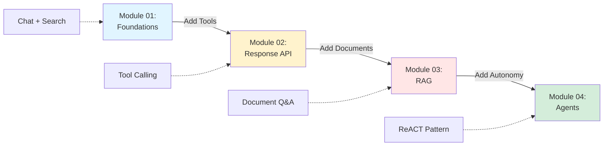

---

## 📋 Session Overview (90 Minutes)

| Time | Module | Focus | Demo |
|------|--------|-------|------|
| 0-10 min | **Setup** | Environment & Connection | Verify setup |
| 10-30 min | **01: Foundations** | Core APIs & Vector Search | Chat + Search |
| 30-45 min | **02: Responses** | Tool Calling | Web Search Bot |
| 45-70 min | **03: RAG** | Document Q&A | RAG Pipeline |
| 70-85 min | **04: Agents** | Autonomous Agents | Simple Agent |
| 85-90 min | **Wrap-up** | Next Steps & Projects | - |

---

## ⚡ Quick Start (10 minutes)

### Prerequisites Check

```bash
# Verify Python version (need 3.12+)
python --version

```

Install Ollama by following the instructions on the [Ollama website](https://ollama.com/download), then download Llama 3.2 3B model, and then start the Ollama service.

```bash
ollama pull llama3.2:3b
ollama run llama3.2:3b --keepalive 60m
```

### Environment Setup

First, install [`uv`](https://docs.astral.sh/uv/getting-started/installation/), a fast Python package manager.

```bash
# 1. Navigate to demos directory
cd llama-stack-demos
# 1️⃣ Create a virtual environment in the current directory (.venv)
#    - Use Python 3.12 explicitly
#    - --seed ensures pip and core packaging tools are installed in the venv
uv venv --python 3.12 --seed

# 2️⃣ Activate the virtual environment
#    - Updates PATH so `python` and `pip` now point to .venv/bin/
#    - Sets VIRTUAL_ENV for the current shell session
source .venv/bin/activate

# 3️⃣ Install or upgrade the llama_stack package inside the active venv
#    - -U (or --upgrade) ensures the latest version is installed
#    - This installs the CLI (`llama`) and required core dependencies
uv pip install -U llama_stack

# 3.5️⃣ Install or upgrade the llama-stack-client SDK
#    - This is the Python client library for interacting with a Llama Stack server
#    - Provides high-level APIs for inference, agents, safety, and more
uv pip install -U llama-stack-client

# 4️⃣ Install additional dependencies required by the "starter" demo profile
#    - `llama stack list-deps starter` prints required packages (one per line)
#    - `xargs -L1 pip install` installs each dependency line-by-line
#    - Assumes the virtual environment is active
llama stack list-deps starter | xargs -L1 uv pip install
```

### Start Llama Stack Server

```bash
# Run the "starter" demo using a local Ollama server
#    - OLLAMA_URL sets the endpoint for the Ollama model server
#    - This environment variable applies only to this command
#    - The starter demo connects to Ollama at localhost:11434
OLLAMA_URL=http://localhost:11434/v1 llama stack run starter

# Expected output: Server running on http://localhost:8321
```

### Test Connection

```bash
# In your main terminal
cd demos
python -m demos.01_foundations.01_client_setup localhost 8321
```

✅ **Checkpoint**: You should see connection successful message

---

## 🎯 Module 01: Foundations (20 minutes)

### Key Concepts

**What is Llama Stack?**
- Unified framework for building AI apps
- Provides: Models, Vector DB, Tools, Agents etc.
- Works with multiple providers (Ollama, Together, etc.)

**Core Components:**

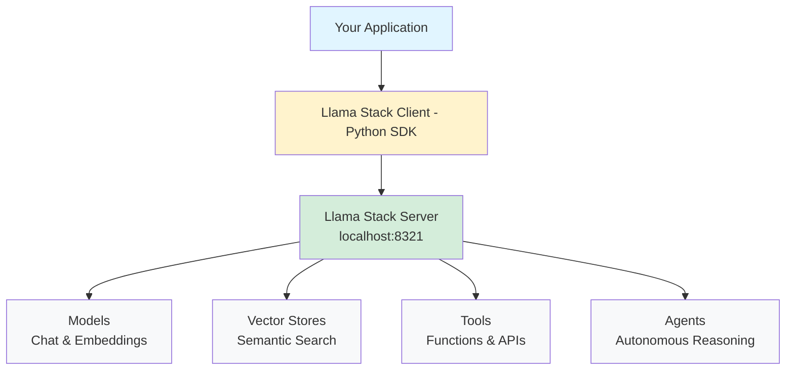

### Demo 1: Chat Completion (5 min)

**Run the demo:**
```bash
python -m demos.01_foundations.02_chat_completion localhost 8321 \
  --prompt "Explain what Llama Stack is in one sentence"
```

**What's happening:**
1. Client sends prompt to Llama Stack
2. Model generates response
3. Response streams back to client

**Try it yourself:**
```bash
# Change the prompt
python -m demos.01_foundations.02_chat_completion localhost 8321 \
  --prompt "Write a haiku about AI"
```

### Demo 2: Vector Search (10 min)

**Why Vector Search?**
- Enables semantic search (meaning-based, not keyword-based)
- Foundation for RAG (Retrieval-Augmented Generation)
- Powers document Q&A systems

**Create a vector store:**
```bash
# 1. Create vector database
python -m demos.01_foundations.04_vector_db_basics localhost 8321

# 2. Insert sample documents
python -m demos.01_foundations.05_insert_documents localhost 8321

# 3. Search for information
python -m demos.01_foundations.06_search_vectors localhost 8321 \
  --query "how to train a model"
```

**How it works:**

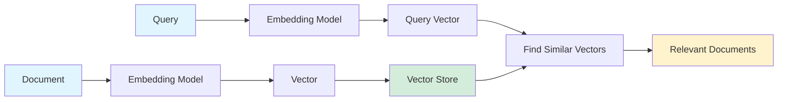

✅ **Checkpoint**: Can you search for "machine learning"?

---

## 🛠️ Module 02: Responses API (15 minutes)

### Key Concepts

#### What is the Response API?

The **Response API** is a high-level interface that extends basic chat with powerful capabilities:
- **Tool Calling**: AI can automatically use external functions/APIs
- **Structured Outputs**: Generate validated JSON responses
- **Conversation Management**: Built-in multi-turn conversation handling
- **Instructions**: High-level guidance separate from messages

#### Response API vs Chat Completions

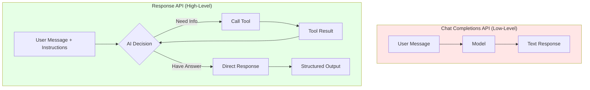

**Comparison:**

| Feature | Chat Completions | Response API |
|---------|------------------|--------------|
| **Complexity** | Simple, direct | Rich, feature-full |
| **Tool Calling** | Manual (you handle) | Automatic |
| **Use Case** | Basic chat | Complex workflows |
| **Control** | Low-level control | High-level orchestration |
| **Best For** | Simple Q&A | Production apps |

#### Why Use Response API?

**Use Chat Completions when:**
- ✅ You need simple text generation
- ✅ You want full control over every step
- ✅ Building basic chatbots
- ✅ Prototyping quickly

**Use Response API when:**
- ✅ AI needs to use tools/APIs
- ✅ You want structured JSON output
- ✅ Building production applications
- ✅ Need multi-step reasoning
- ✅ Want conversation state management

**Example Scenario:**
```
User: "What's the weather in San Francisco?"

With Chat Completions:
1. You manually detect this needs weather API
2. You call the weather API yourself
3. You pass results back to the model
4. You parse the response

With Response API:
1. AI automatically detects it needs weather data
2. AI calls the registered weather tool
3. AI synthesizes the answer
4. You get the final result
```

#### Tool Calling Explained

**Tool Calling** = Giving AI the ability to use external functions and APIs

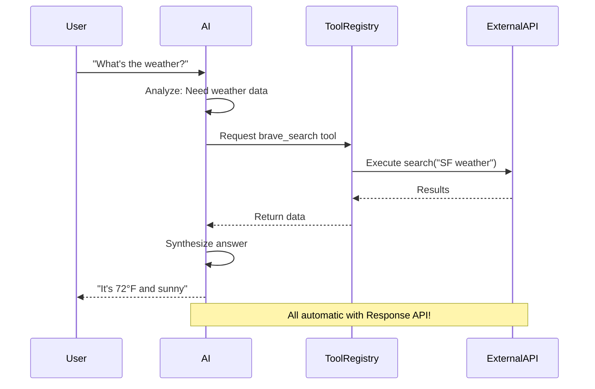

### Demo: Web Search Tool (12 min)

**Run the demo:**
```bash
python -m demos.02_responses_basics.02_tool_calling localhost 8321 \
  --prompt "What is the weather in San Francisco?"
```

**What's happening:**

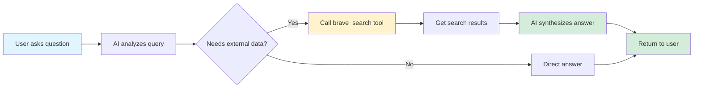

**How tool calling works:**

```python
# Simplified concept
tools = [
    {
        "name": "brave_search",
        "description": "Search the web",
        "parameters": {"query": "string"}
    }
]

# AI decides when to use tools
response = client.responses.create(
    instructions="You are a helpful assistant",
    messages=[{"role": "user", "content": "What's the weather?"}],
    tools=tools
)
```

**Try it yourself:**
```bash
# Ask something requiring current information
python -m demos.02_responses_basics.02_tool_calling localhost 8321 \
  --prompt "What are the latest AI developments this week?"
```

✅ **Checkpoint**: Did the AI use the web search tool?

---

## 📚 Module 03: RAG - Document Q&A (25 minutes)

### Key Concepts

**RAG = Retrieval-Augmented Generation**

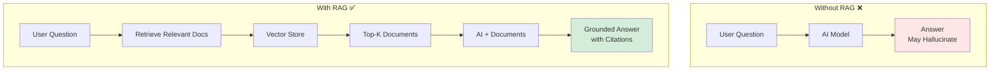

**Why RAG?**
- ✅ Ground AI in your documents
- ✅ Reduce hallucinations
- ✅ Enable Q&A on private/custom data
- ✅ Citations & sources

### RAG Pipeline

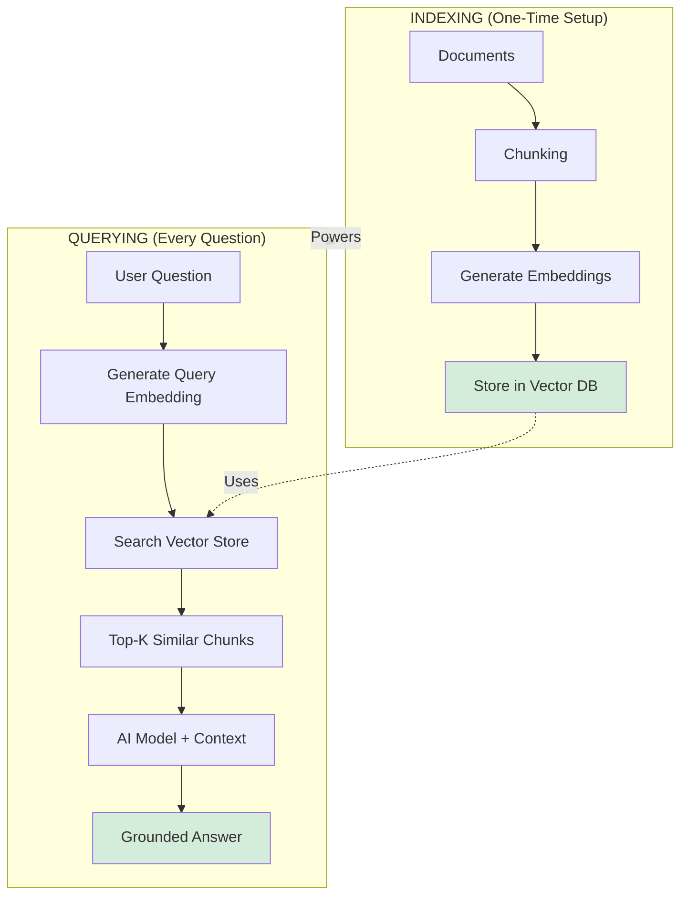

### Demo 1: Simple RAG (10 min)

**Run the demo:**
```bash
python -m demos.03_rag.01_simple_rag localhost 8321
```

**What's happening:**
1. Loads sample documents (about Llama models)
2. Creates embeddings
3. Stores in vector database
4. Asks question: "What is Llama 3?"
5. Retrieves relevant chunks
6. Generates grounded answer

**Key code concept:**
```python
# 1. Create file_search tool (built-in RAG)
tools = [{
    "type": "file_search",
    "file_ids": ["doc1", "doc2"]  # Your documents
}]

# 2. Ask questions
response = client.responses.create(
    messages=[{
        "role": "user",
        "content": "What is Llama 3?"
    }],
    tools=tools  # AI will search files
)
```

### Demo 2: Multi-Source RAG (8 min)

**Run the demo:**
```bash
python -m demos.03_rag.02_multi_source_rag localhost 8321
```

**What this shows:**
- Search across **multiple vector stores**
- Different document collections (e.g., manuals, research papers, FAQs)
- Combine results from multiple sources

**Real-world use cases:**
- Customer support: Product docs + FAQs + release notes
- Research: Multiple papers/sources
- Enterprise: Different department knowledge bases

### Hands-On Exercise (7 min)

**Challenge**: Add your own documents

1. Create a text file:
```bash
echo "San Jose State University is a public university in California.
It was founded in 1857 and specializes in technology and engineering." > sjsu_info.txt
```

2. Modify the RAG demo to:
   - Index your document
   - Ask questions about SJSU

**Hints:**
- Look at `03_rag/01_simple_rag.py`
- Find where documents are loaded
- Add your file to the list

✅ **Checkpoint**: Can you answer "When was SJSU founded?" using RAG?

---

## 🤖 Module 04: Agents (15 minutes)

### Key Concepts

#### What is an Agent?

An **Agent** is an autonomous AI system that can:
- **Plan**: Break down complex tasks into steps
- **Act**: Execute tools and APIs independently
- **Observe**: Evaluate results and decide next actions
- **Iterate**: Loop through multiple steps until task completion
- **Remember**: Maintain conversation context across turns

**Key Difference from Tool Calling:**
- **Tool Calling**: Single-step, one tool use per request
- **Agent**: Multi-step, autonomous decision-making loop

#### Agent vs Tool Calling

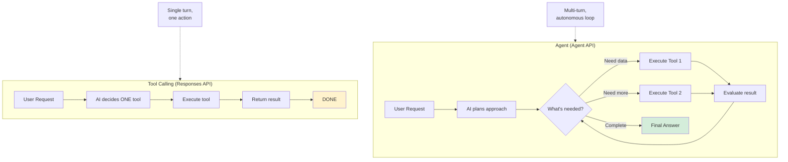

#### The ReACT Pattern

**ReACT** = **Re**asoning + **ACT**ing

This is the core pattern that makes agents intelligent:

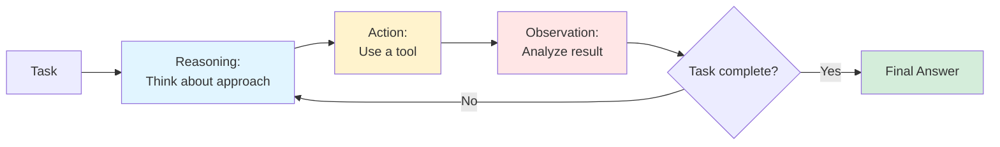

**ReACT Example:**

```
User: "Find recent AI papers and summarize the top 3"

ReACT Loop:
┌─ Step 1 ─────────────────────────────┐
│ Reasoning: Need to search for papers │
│ Action: web_search("recent AI papers")│
│ Observation: Found 20 papers          │
└───────────────────────────────────────┘

┌─ Step 2 ─────────────────────────────┐
│ Reasoning: Need details on top 3     │
│ Action: fetch_paper_details(paper_1) │
│ Observation: Got abstract & authors  │
└───────────────────────────────────────┘

┌─ Step 3 ─────────────────────────────┐
│ Reasoning: Repeat for paper 2 & 3    │
│ Action: fetch_paper_details(paper_2) │
│ Action: fetch_paper_details(paper_3) │
│ Observation: All data collected      │
└───────────────────────────────────────┘

┌─ Step 4 ─────────────────────────────┐
│ Reasoning: Have all info, summarize  │
│ Action: None (just synthesize)       │
│ Result: "Here are the top 3 papers..." │
└───────────────────────────────────────┘
```

**Why ReACT is Powerful:**
- 🧠 **Reasoning**: Agent thinks before acting
- 🔧 **Acting**: Agent can use multiple tools
- 👁️ **Observing**: Agent learns from results
- 🔄 **Iterating**: Agent adapts its approach

#### Agent Capabilities

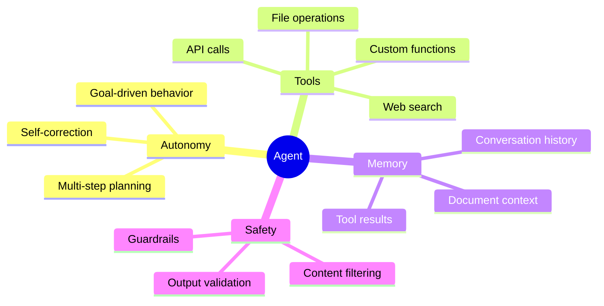

### Demo 1: Simple Agent Chat (5 min)

**Run the demo:**
```bash
python -m demos.04_agents.01_simple_agent_chat localhost 8321
```

**What you'll see:**
- Multi-turn conversation
- Agent maintains context
- Natural dialogue flow

**Try it:**
- Ask follow-up questions
- Reference previous messages
- Test memory retention

### Demo 2: Document-Grounded Agent (5 min)

**Run the demo:**
```bash
python -m demos.04_agents.03_chat_with_documents localhost 8321
```

**What this shows:**
- Agent with access to documents
- Automatically searches when needed
- Provides sourced answers

**Agent workflow:**

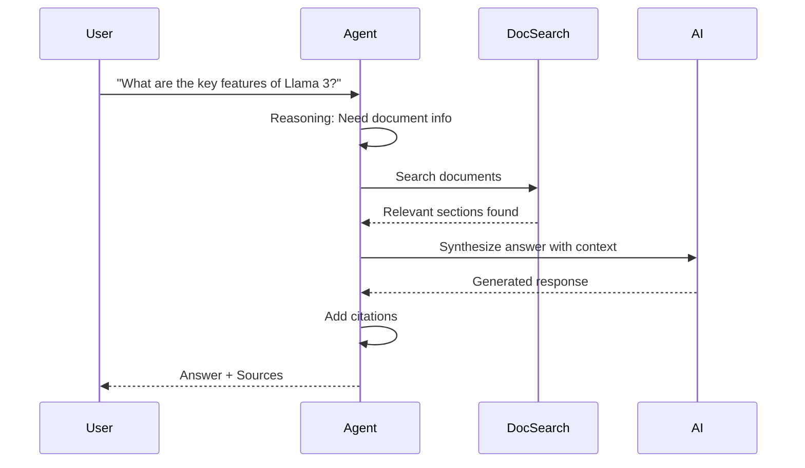

### Demo 3: ReACT Agent (8 min)

**Run the demo:**
```bash
python -m demos.04_agents.06_react_agent localhost 8321
```

**What is ReACT Agent?**

This demo shows the **ReACT pattern** in action - the agent will:
1. **Think**: Reason about what's needed
2. **Act**: Use tools to gather information
3. **Observe**: Evaluate the results
4. **Repeat**: Continue until task is complete

**Example Interaction:**

```
You: "Find information about Llama 3 and compare it with GPT-4"

Agent Reasoning Loop:
┌─ Thought 1 ──────────────────────────┐
│ I need information about both models │
│ Let me search for Llama 3 first     │
└───────────────────────────────────────┘
┌─ Action 1 ───────────────────────────┐
│ Tool: web_search                     │
│ Query: "Llama 3 features specs"      │
└───────────────────────────────────────┘
┌─ Observation 1 ──────────────────────┐
│ Found: Llama 3 has 8B, 70B variants  │
│ Open source, high performance        │
└───────────────────────────────────────┘

┌─ Thought 2 ──────────────────────────┐
│ Now I need GPT-4 information         │
└───────────────────────────────────────┘
┌─ Action 2 ───────────────────────────┐
│ Tool: web_search                     │
│ Query: "GPT-4 specifications"        │
└───────────────────────────────────────┘
┌─ Observation 2 ──────────────────────┐
│ Found: GPT-4 proprietary, larger     │
│ Advanced reasoning capabilities      │
└───────────────────────────────────────┘

┌─ Thought 3 ──────────────────────────┐
│ I have info on both, can compare     │
└───────────────────────────────────────┘
┌─ Final Answer ───────────────────────┐
│ Here's a comparison:                 │
│ Llama 3: Open source, 8B-70B...      │
│ GPT-4: Proprietary, larger scale...  │
└───────────────────────────────────────┘
```

**Why This Matters:**
- Agent breaks down complex tasks automatically
- Multiple tool uses in sequence
- Self-directed reasoning
- No manual orchestration needed

**Try asking:**
```
"Research the latest AI models and tell me which one is best for coding tasks"
"Find information about vector databases and recommend one for my project"
```

The agent will autonomously plan, search, and synthesize an answer!

### When to Use Each API

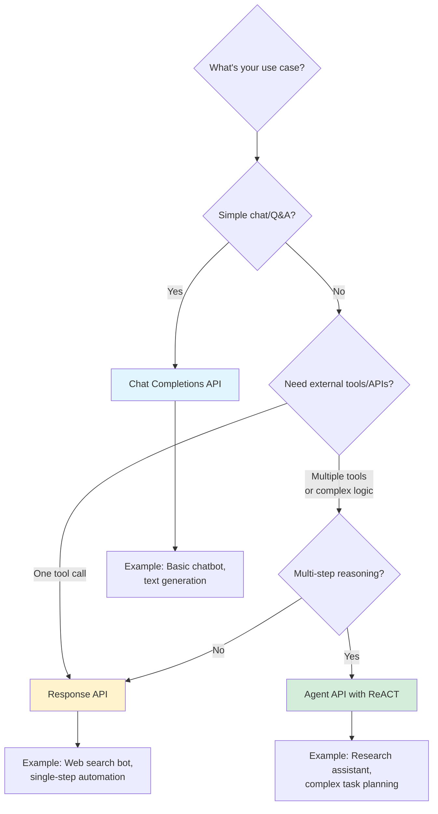

**Decision Matrix:**

| Scenario | Best Choice | Why |
|----------|-------------|-----|
| Simple question | Chat Completions | Fast, direct |
| Needs one tool call | Response API | Built-in tool orchestration |
| Multi-step reasoning | **Agent + ReACT** | Autonomous planning |
| Complex workflows | **Agent + ReACT** | Self-directed iteration |
| Task decomposition | **Agent + ReACT** | Breaks down problems |
| Research & analysis | **Agent + ReACT** | Multiple info sources |

**Quick Rule:**
- 📝 **Chat**: Direct text in/out
- 🔧 **Response**: AI + 1 tool
- 🤖 **Agent**: AI + multiple tools + reasoning loop

✅ **Checkpoint**: Can you explain when to use ReACT pattern?

---

## 🎯 Putting It All Together

### What You've Learned

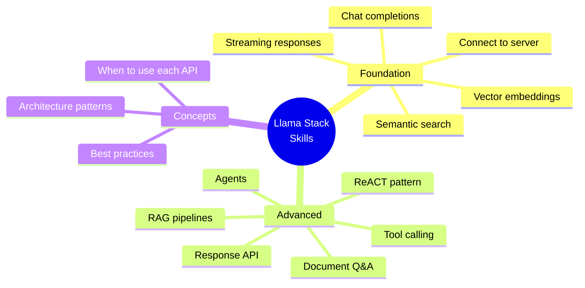

### Architecture Patterns

**Pattern 1: Simple Chatbot**

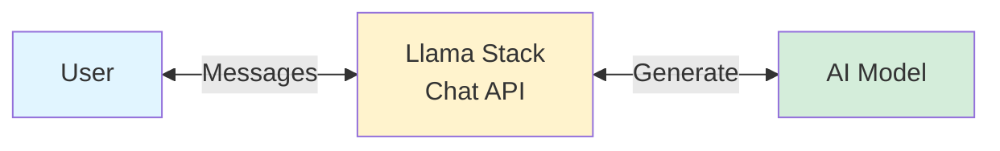

**Pattern 2: RAG Application**

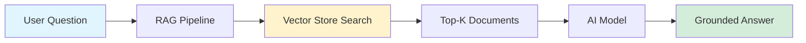

**Pattern 3: Autonomous Agent**

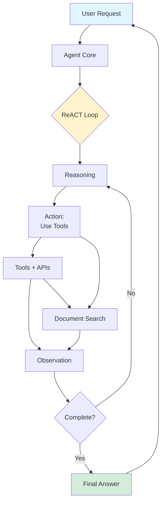

### Complete Learning Journey

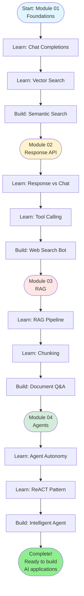

---

## 💡 Next Steps & Projects

### Beginner Projects (Start Here!)

**1. Personal Document Q&A**
- Upload your notes/PDFs
- Use RAG to answer questions
- Add web search for current info

**2. Course Assistant**
- Index course materials
- Answer student questions
- Cite specific sections

**3. Research Helper**
- Store academic papers
- Semantic search across papers
- Summarize findings

### Intermediate Projects

**4. Customer Support Bot**
- Product documentation RAG
- Multi-source search (docs + FAQs + updates)
- Tool calling for ticket creation

**5. Multi-Agent System**
- Research agent (finds info)
- Writer agent (creates content)
- Coordinator (manages workflow)

### Advanced Projects

**6. Enterprise Knowledge System**
- Multi-department document stores
- Role-based access control
- Advanced metadata filtering
- Analytics dashboard

**7. Intelligent Assistant**
- Multi-modal (text + images)
- Complex task planning
- External API integrations
- Proactive suggestions

---

## 🛠️ Quick Reference

### Essential Commands

```bash
# Start server
OLLAMA_URL=http://localhost:11434/v1 llama stack run starter

# Run demos (from demos/ directory)
python -m demos.01_foundations.02_chat_completion localhost 8321
python -m demos.03_rag.01_simple_rag localhost 8321
python -m demos.04_agents.01_simple_agent_chat localhost 8321
```

### Code Templates

**Simple Chat:**
```python
from llama_stack_client import LlamaStackClient

client = LlamaStackClient(base_url="http://localhost:8321")

response = client.inference.chat_completion(
    model_id="Llama3.1-8B-Instruct",
    messages=[{"role": "user", "content": "Hello!"}],
    stream=False
)
print(response.completion_message.content)
```

**RAG Pattern:**
```python
# 1. Index documents
vector_store = client.vector_dbs.create(...)
client.vector_dbs.insert(vector_store_id, documents)

# 2. Query with file_search
tools = [{"type": "file_search", "file_ids": [...]}]
response = client.responses.create(
    messages=[{"role": "user", "content": "Your question"}],
    tools=tools
)
```

**Agent Pattern:**
```python
# Create session
session = client.agents.create_session(
    agent_id="my_agent",
    session_name="chat_session"
)

# Chat with agent
response = client.agents.create_turn(
    session_id=session.session_id,
    messages=[{"role": "user", "content": "Question"}]
)
```

---

## 🔧 Troubleshooting

### Common Issues

**1. Server won't start**
```bash
# Check if Ollama is running
curl http://localhost:11434

# Verify port 8321 is free
lsof -i :8321
```

**2. Connection refused**
```bash
# Make sure server is running
# Check firewall settings
# Verify URL: http://localhost:8321
```

**3. Demos fail**
```bash
# Verify you're in demos/ directory
pwd  # Should show .../llama-stack-demos/demos

# Check Python path
python -c "import sys; print(sys.path)"
```

**4. Out of memory**
- Use smaller batch sizes
- Reduce chunk sizes
- Use lighter model

---

## 📚 Resources & Documentation

### Official Resources
- **Llama Stack GitHub**: [github.com/meta-llama/llama-stack](https://github.com/meta-llama/llama-stack)
- **API Documentation**: Check the GitHub repo
- **Model Context Protocol**: [modelcontextprotocol.org](https://modelcontextprotocol.org)

### Learning More
- **Vector Databases**: Learn about FAISS, Chroma, Weaviate
- **Embeddings**: Understand how semantic similarity works
- **Prompt Engineering**: Best practices for AI instructions
- **LangChain**: Alternative framework for comparison

### Community
- GitHub Issues for questions
- Share your projects!
- Contribute improvements

---

## 📊 Self-Assessment

### API Comparison Summary

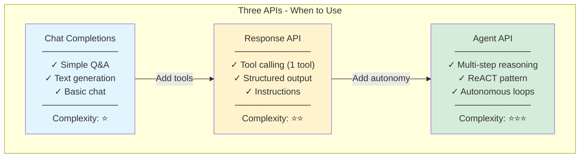

### Check Your Understanding

**Module 01: Foundations**
- [ ] Can you connect to Llama Stack?
- [ ] Do you understand what vector embeddings are?
- [ ] Can you perform semantic search?
- [ ] Can you explain the difference between semantic and keyword search?

**Module 02: Responses**
- [ ] Can you explain the difference between Response API and Chat Completions?
- [ ] Do you understand what tool calling is?
- [ ] Can you explain why Response API is better for production?
- [ ] Can you use web search in responses?

**Module 03: RAG**
- [ ] Can you explain the RAG pipeline (Indexing + Querying)?
- [ ] Do you understand chunking strategies?
- [ ] Can you build a document Q&A system?
- [ ] Do you know when to use RAG vs fine-tuning?

**Module 04: Agents**
- [ ] Can you explain what makes an agent "autonomous"?
- [ ] Do you understand the ReACT pattern (Reasoning + Acting)?
- [ ] Can you explain when to use Agents vs Response API?
- [ ] Can you create a multi-step agent workflow?

---

## 🎓 Course Completion

### You've Completed the Hands-On Session! 🎉

**Skills Acquired:**
- ✅ Llama Stack fundamentals
- ✅ Vector search & embeddings
- ✅ Tool calling patterns
- ✅ RAG pipeline implementation
- ✅ Agent-based applications

**What's Next?**
1. **Practice**: Build your own project
2. **Explore**: Try advanced demos
3. **Share**: Present your work
4. **Learn**: Read documentation
5. **Contribute**: Help improve demos

---

## 💬 Feedback & Questions

### During the Session
- Ask questions anytime!
- Experiment and break things
- Help your classmates

### After the Session
- Open GitHub issues for bugs
- Share project ideas
- Suggest improvements

---

## 📝 Quick Wins Checklist

Before you leave, make sure you can:

- [ ] Start Llama Stack server
- [ ] Run a chat completion
- [ ] Perform vector search
- [ ] Use tool calling with web search
- [ ] Build a simple RAG pipeline
- [ ] Create a basic agent
- [ ] Explain the difference between Chat, Responses, and Agents APIs

---

## 🚀 Final Challenge

**Build your first AI app** (choose one):

**Option 1: Study Buddy** (30 min)
- Index your course notes
- Ask questions about the material
- Get sourced answers

**Option 2: News Researcher** (30 min)
- Tool calling for web search
- Summarize current events
- Save findings to file

**Option 3: Smart Agent** (45 min)
- Combine RAG + Tools + Agent
- Multi-step reasoning
- Handle complex queries

---

## 🎯 Remember

**The Goal** isn't to memorize everything—it's to understand:
1. **What** each component does
2. **When** to use which pattern
3. **How** to combine them

**Keep experimenting, keep building, keep learning!**

---

**Session Created For**: San Jose State University
**Duration**: 90 minutes
**Format**: Hands-on coding session
**Modules Covered**: Foundations → Responses → RAG → Agents

**Good luck and have fun building AI applications!** 🤖✨

---

*Last Updated: February 2026*
*Version: 1.0 - SJSU 90-Min Session*
