# Llama Stack Introduction
---

## Agenda

1. What is Llama Stack? (8 min)
2. Core Architecture & APIs (12 min)
3. Providers & Distributions (7 min)
4. Q&A (3 min)

---

## 1. What is Llama Stack?

### The Problem: AI Application Development is Fragmented

Today, building a production-grade AI application requires integrating many components — each with its own API, its own SDK, and its own deployment story.

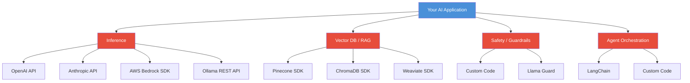

**Pain points:**
- Every provider has a different API, switching means rewriting code
- No pattern to compose Inference + RAG + Safety + Agents together
- Each component has its own auth, error handling, and streaming patterns
- From local prototype (Ollama) to production (cloud) often requires a complete rewrite

### Thick Client / Thin Server (The Status Quo)

Today's approach puts all the complexity on the client side. Each AI framework (LangChain, CrewAI, LlamaIndex, etc.) builds its own bespoke integrations for every capability — tools, agents, vector databases, guardrails, and more. The server side is minimal, typically just a chat completions endpoint.

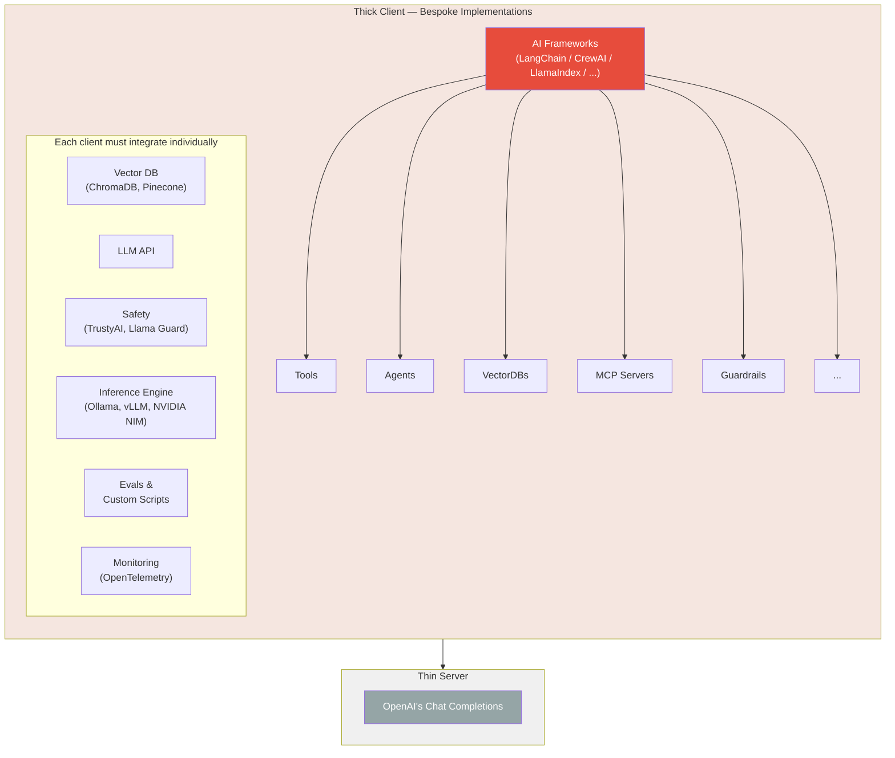

### Thin Client / Thick Server (The Llama Stack Approach)

Llama Stack flips this model. Clients become thin — they focus only on orchestration. The server becomes thick, offering a comprehensive set of APIs that handle all the heavy lifting.

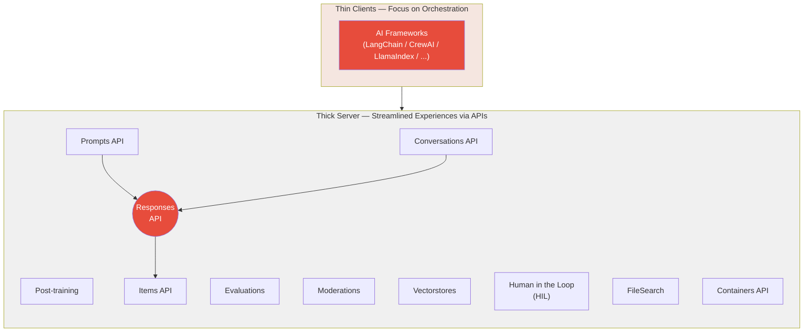

### The Solution: Llama Stack

Llama Stack is an **open-source framework** (MIT License) that defines a **unified API layer** for all the building blocks of AI application development.

Think of it as **"JDBC for AI"** — just like JDBC lets you swap MySQL for PostgreSQL without changing your Java code, Llama Stack lets you swap Ollama for OpenAI (or AWS Bedrock, or vLLM) without changing your application code.

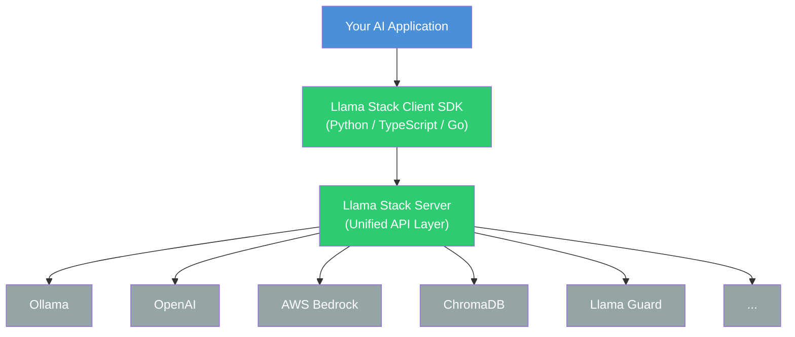

### Key Value Propositions

| Value | Description |
|-------|-------------|
| **Unified APIs** | One set of APIs for Inference, RAG, Agents, Safety, Eval, Tool Calling, etc. |
| **OpenAI Compatible** | Exposes OpenAI-compatible endpoints — existing OpenAI SDK code just works |
| **Plugin Architecture** | Swap providers without code changes, providers are hot-pluggable |
| **Flexible Deployment** | Same code runs locally, on-prem, cloud |
| **Multi-language SDKs** | Python, TypeScript, Go |
| **Production Ready** | Built-in auth, rate limiting, RBAC, telemetry, streaming support |

---

## 2. Core Architecture & APIs

### Overall Architecture

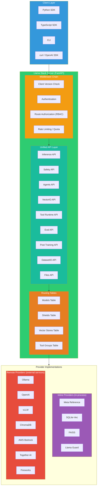

### Core APIs in Detail

#### Inference API — The Heart of Llama Stack

Inference API is **fully OpenAI-compatible**, meaning you can use the standard OpenAI SDK to talk to Llama Stack.

**Exposed Endpoints:**

| Endpoint | Description |
|----------|-------------|
| `POST /v1/chat/completions` | Chat completions (streaming & non-streaming) |
| `POST /v1/completions` | Text completions |
| `POST /v1/embeddings` | Generate embeddings |
| `POST /v1/rerank` | Rerank documents by relevance |
| `GET /v1/chat/completions` | List stored completions |
| `GET /v1/chat/completions/{id}` | Retrieve a specific completion |

#### Agents API — Autonomous AI Agents

The Agents API follows the **OpenAI Responses API format**, enabling multi-step reasoning with tool use.

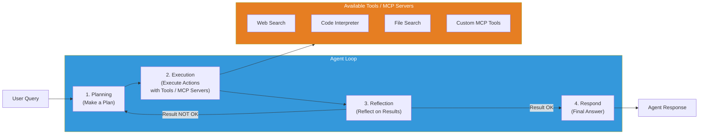

**Key Features:**
- OpenAI-compatible Responses API format
- Multi-turn conversation with session persistence
- Built-in tool calling (web search, code execution, file search)
- Support for **MCP (Model Context Protocol)** external tools
- Response guardrails through Safety API integration
- Streaming support for real-time token delivery

#### VectorIO API — RAG Made Easy

VectorIO API provides a **unified interface for vector databases**, making RAG (Retrieval-Augmented Generation) portable across different storage backends.

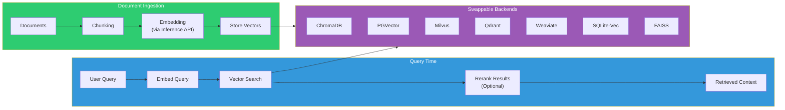

**How RAG works step-by-step:**

1. **Chunking** — Documents are split into smaller, semantically meaningful pieces (chunks). This is necessary because embedding models have a token limit, and smaller chunks produce more precise retrieval results. Common strategies include fixed-size chunking, sentence-based splitting, and recursive character splitting.

2. **Embedding** — Each chunk is passed through an embedding model (e.g., `all-MiniLM-L6-v2`, OpenAI `text-embedding-3-small`) via the Inference API. The model converts the text into a high-dimensional dense vector (e.g., 384 or 1536 dimensions) that captures semantic meaning — similar texts produce vectors that are close together in vector space.

3. **Storing** — The resulting vectors, along with the original chunk text as metadata, are stored in a vector database (ChromaDB, PGVector, FAISS, etc.) via the VectorIO API.

4. **Embed Query** — At query time, the user's question is embedded using the **same** embedding model to produce a query vector in the same vector space.

5. **Vector Search** — The query vector is compared against all stored vectors using a similarity metric (cosine similarity, dot product, or L2 distance). The top-K most similar chunks are returned as candidate results.

6. **Rerank (Optional)** — A cross-encoder reranker model scores each candidate chunk against the original query for more accurate relevance ranking. This is more expensive but significantly improves precision.

The retrieved context is then injected into the LLM prompt alongside the user's question, enabling the model to generate answers grounded in the retrieved documents.

## 3. Providers & Distributions

### Provider Architecture

A **Provider** is a concrete implementation of a Llama Stack API. Each API can have multiple providers, and you can mix and match them.

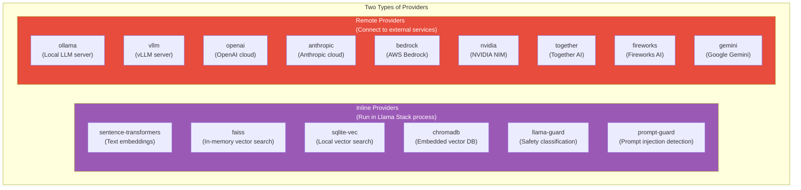

#### Inline vs Remote Providers

The core difference between the two provider types is **where the code executes**.

**Inline Providers** run directly inside the Llama Stack server process, sharing the same Python runtime and memory. There is zero network overhead — calls are just regular function invocations. However, the server itself must have sufficient resources (GPU, memory). This makes inline providers ideal for local development, edge deployments, and latency-sensitive scenarios.

| Inline Provider | Purpose | Details |
|-----------------|---------|---------|
| `sentence-transformers` | Embeddings | Runs embedding models locally for text embeddings and similarity search |
| `transformers` | Reranking | Runs neural rerank models locally via HuggingFace Transformers |
| `faiss` | Vector search | Builds FAISS index in memory, no external service needed |
| `sqlite-vec` | Vector search | Uses SQLite extension for vector search, data stored in local files |
| `chromadb` | Vector search | Runs ChromaDB embedded (in-process), no separate server needed |
| `llama-guard` | Safety | Loads Llama Guard model locally for content safety classification |
| `prompt-guard` | Safety | Detects prompt injection and jailbreak attempts locally |
| `code-scanner` | Safety | Scans generated code for insecure patterns |

**Remote Providers** communicate with external services over the network. The Llama Stack server handles request forwarding and protocol translation, while the actual computation happens remotely. The server does not need a GPU or large amounts of memory, but latency depends on network conditions and the external service's availability. This makes remote providers well-suited for production environments, multi-tenant setups, and cloud-based workloads.

| Remote Provider | Purpose | Details |
|-----------------|---------|---------|
| `ollama` | Inference | Calls local Ollama server's REST API (separate process) |
| `vllm` | Inference | Calls a separately deployed vLLM inference server |
| `openai` | Inference | Calls OpenAI's cloud API |
| `anthropic` | Inference | Calls Anthropic's cloud API |
| `gemini` | Inference | Calls Google Gemini API |
| `bedrock` | Inference | Calls Amazon Bedrock via AWS SDK |
| `nvidia` | Inference | Calls NVIDIA NIM microservices |
| `together` | Inference | Calls Together AI's cloud API |
| `fireworks` | Inference | Calls Fireworks AI's cloud API |
| `chromadb` | Vector search | Connects to a ChromaDB server for vector storage and retrieval |
| `pgvector` | Vector search | Connects to PostgreSQL with pgvector extension |
| `weaviate` | Vector search | Connects to a Weaviate vector database |

The key insight is that **your application code does not need to know which provider type is being used**. The API is unified — switching providers is purely a configuration change:

```yaml
# Inline FAISS (local development)
vector_io:
  - provider_id: faiss
    provider_type: inline::faiss

# Remote ChromaDB (production)
vector_io:
  - provider_id: chromadb
    provider_type: remote::chromadb
    config:
      url: http://chromadb-server:8000
```

**Provider Spec Example (how a provider is registered):**
```python
RemoteProviderSpec(
    api=Api.inference,
    adapter_type="ollama",
    provider_type="remote::ollama",
    pip_packages=["ollama", "aiohttp"],
    config_class="...ollama.OllamaImplConfig",
    module="...providers.remote.inference.ollama",
)
```

### Routing Table — Smart Request Dispatch

The **Routing Table** is the mechanism that maps a resource (e.g., a model name) to the correct provider. This enables multi-provider setups.

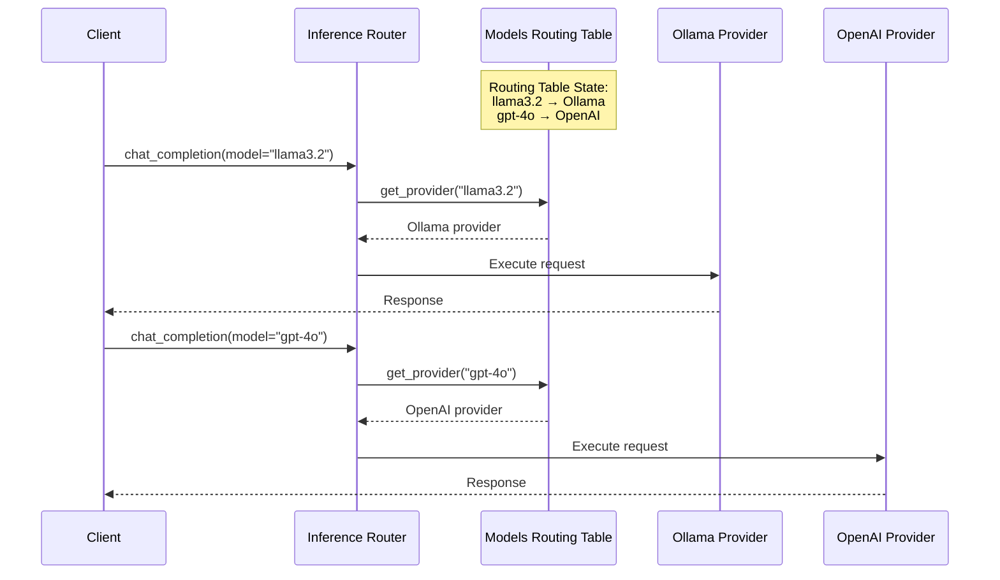

Each API has its own routing table:

| Routing Table | Routes | Example |
|--------------|--------|---------|
| Models Table | model_id → inference provider | "llama3.2" → Ollama |
| Shields Table | shield_id → safety provider | "llama-guard" → Llama Guard |
| Vector Stores Table | store_id → vector_io provider | "my-docs" → ChromaDB |
| Tool Groups Table | tool_group_id → tool_runtime provider | "web-tools" → Tavily |

### What is a Distribution?

A **Distribution** is a **pre-configured bundle of providers** — like a Kubernetes distribution (OpenShift, EKS, GKE) packages the same core K8s APIs with different networking, storage, and auth implementations underneath.

```mermaid
graph TB
    subgraph StarterDist["Starter Distribution"]
        direction TB
        SD_Inf["Inference: Ollama + OpenAI + Together + Fireworks + ..."]
        SD_Vec["VectorIO: FAISS + SQLite-Vec + Milvus"]
        SD_Safe["Safety: Llama Guard + Code Scanner"]
        SD_Agent["Agents: Built-in"]
        SD_Tool["Tools: Built-in + MCP Support"]
    end

    subgraph K8sDist["Kubernetes Distribution"]
        direction TB
        K8_Inf["Inference: vLLM (Serving on GPU nodes)"]
        K8_Vec["VectorIO: PGVector (PostgreSQL)"]
        K8_Safe["Safety: Llama Guard"]
        K8_Agent["Agents: Built-in"]
        K8_Tool["Tools: Built-in + MCP Support"]
        K8_Auth["Auth: Kubernetes RBAC"]
    end

    subgraph DellDist["Dell Distribution"]
        direction TB
        DL_Inf["Inference: Optimized for Dell HW"]
        DL_Vec["VectorIO: Optimized storage"]
        DL_Safe["Safety: Llama Guard"]
        DL_Agent["Agents: Built-in"]
        DL_Tool["Tools: Built-in"]
    end

    style StarterDist fill:#2ECC71,color:#fff
    style K8sDist fill:#3498DB,color:#fff
    style DellDist fill:#9B59B6,color:#fff
```

**Why a Kubernetes Distribution?**

In a Kubernetes environment, Llama Stack runs as a Pod alongside other services. A typical setup might look like:

- **Inference**: `remote::vllm` — vLLM runs as a separate Deployment on GPU nodes, Llama Stack connects via a Kubernetes Service
- **VectorIO**: `remote::pgvector` — PostgreSQL with pgvector runs as a StatefulSet, providing persistent vector storage
- **Safety**: `inline::llama-guard` — runs inside the Llama Stack Pod
- **Auth**: Kubernetes RBAC — uses the Kubernetes token review API for authentication and authorization

This is the same application code as the Starter distribution — only the `config.yaml` changes.

### The Power: Seamless Environment Transition

The same application code works across all environments — only the distribution config changes.

```mermaid
flowchart LR
    subgraph Dev["Development"]
        D_Dist["Starter Distribution"]
        D_Inf["Ollama (local)"]
        D_Vec["SQLite-Vec (local file)"]
        D_Safe["Llama Guard (local)"]
    end

    subgraph Staging["Staging"]
        S_Dist["Custom Distribution"]
        S_Inf["vLLM (on-prem GPU)"]
        S_Vec["PGVector (shared DB)"]
        S_Safe["Llama Guard (remote)"]
    end

    subgraph Prod["Production"]
        P_Dist["Cloud Distribution"]
        P_Inf["AWS Bedrock"]
        P_Vec["Milvus (managed)"]
        P_Safe["Llama Guard (managed)"]
    end

    Code["Application Code<br/>(UNCHANGED)"] --> Dev
    Code --> Staging
    Code --> Prod

    Dev -->|"Promote"| Staging
    Staging -->|"Promote"| Prod

    style Code fill:#E74C3C,color:#fff
    style Dev fill:#2ECC71,color:#fff
    style Staging fill:#F39C12,color:#fff
    style Prod fill:#3498DB,color:#fff
```
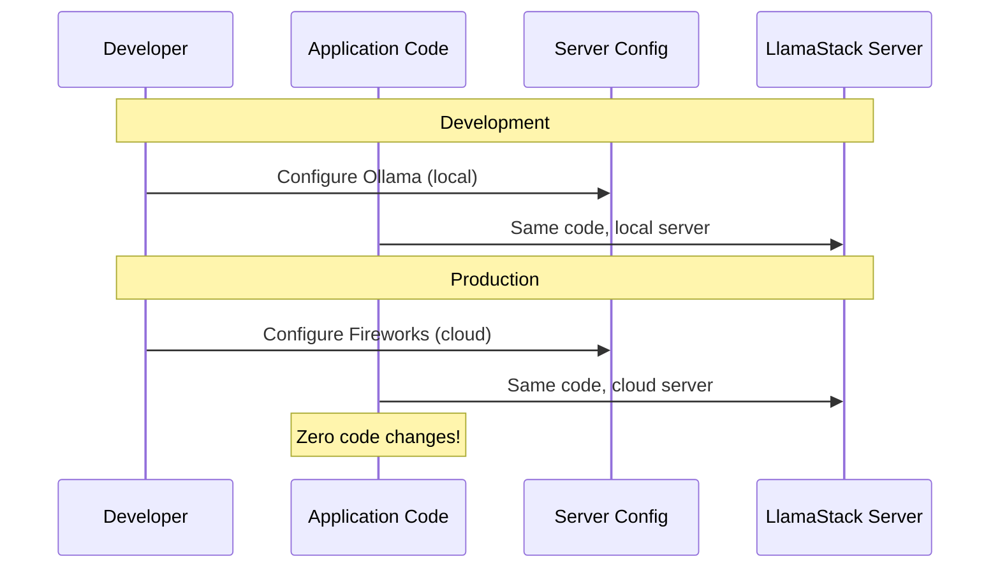


## Why Should You Care?

1. **Learn the full AI stack** — Inference, RAG, Agents, Safety, Eval are the building blocks of every real-world AI product
2. **Open source** — MIT License, active community including Red Hat, Nvidia, Meta etc., great for contributions
3. **No vendor lock-in** — Provider framework
4. **From prototype to production** — Build projects that scale seamlessly
5. **OpenAI-compatible** — If you know the OpenAI API, you already know how to use Llama Stack

---

## About the Author

**Guangya Liu** is a Senior Principal Software Engineer at Red Hat, where he works on Llama Stack. He joined Red Hat in December 2025.

Prior to that, he was a Senior Principal Staff Member at IBM, focusing on open-source contributions and integrations. Over the years, he has been deeply involved in major open-source ecosystems, contributing to projects such as OpenStack, Apache Mesos, Kubernetes, and OpenTelemetry.

He has also held key leadership roles in several communities, including OpenStack Core Member, Apache Mesos Committer and PMC Member, Kubernetes maintainer, and maintainer of the OpenTelemetry GenAI Semantic Conventions.

---

## Resources

| Resource | Link |
|----------|------|
| Documentation | https://llamastack.github.io/docs |
| GitHub | https://github.com/llamastack/llama-stack |
| Quick Start | https://llamastack.github.io/docs/getting_started/quickstart |
| Discord | https://discord.gg/llama-stack |
| Demos | https://github.com/opendatahub-io/llama-stack-demos |
